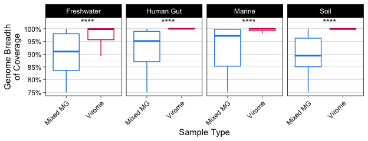
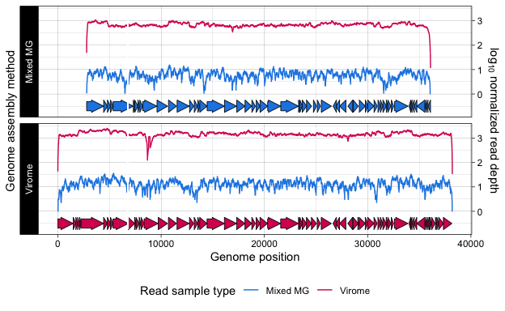

Table S2, Table S3, Table S4, Figure 4
================
James C. Kosmopoulos
2024-07-08

# Load packages

``` r
library(tidyverse); packageVersion("tidyverse")
```

    ## [1] '2.0.0'

``` r
library(reshape2); packageVersion("reshape2")
```

    ## [1] '1.4.4'

``` r
library(ggpubr); packageVersion("ggpubr")
```

    ## [1] '0.6.0'

``` r
library(ggforce); packageVersion("ggforce")
```

    ## [1] '0.4.2'

``` r
library(gggenes); packageVersion("gggenes")
```

    ## [1] '0.5.1'

# Load data and features

``` r
data_reform <- readRDS("../Data/stats_and_metadata.RDS")
depth_per_base <- readRDS("../Data/depth_per_base.RDS")
features <- readRDS("../Data/features_combined.RDS")
rect <- readRDS("../Data/features_absent.RDS")
breadths <- readRDS("../Data/breadths.RDS")
```

# Table S2

``` r
tableS2 <- breadths %>%
  group_by(sample_source, Genome) %>%
  filter(all(c("Virome", "Mixed MG") %in% Method)) %>%
  ungroup() %>%
  mutate(Method = factor(Method, levels = c("Mixed MG", "Virome")))

write_csv(tableS2, file="../Tables/TableS2.csv")
head(tableS2)
```

    ## # A tibble: 6 × 6
    ##   Genome                         Sample Breadth sample_source Environment Method
    ##   <chr>                          <chr>    <dbl> <chr>         <chr>       <fct> 
    ## 1 Ga0485182__vRhyme_unbinned_745 Ga048…   1.00  ME_2020-10-1… Freshwater  Virome
    ## 2 Ga0485186__vRhyme_unbinned_522 Ga048…   0.999 ME_2020-10-1… Freshwater  Virome
    ## 3 Ga0485184__vRhyme_bin_568      Ga048…   1.00  ME_2020-10-1… Freshwater  Virome
    ## 4 Ga0485182__vRhyme_bin_289      Ga048…   0.995 ME_2020-10-1… Freshwater  Virome
    ## 5 Ga0485172__vRhyme_unbinned_163 Ga048…   0.998 ME_2020-10-1… Freshwater  Virome
    ## 6 Ga0485171__vRhyme_bin_11       Ga048…   0.999 ME_2020-10-1… Freshwater  Virome

# Table S3

``` r
tableS3 <- features[ c("Genome", "contig",  "gene", "start", "stop", "start.relative",  "stop.relative", "frame", "phrog", "Method", "annot", "category")]
tableS3$sample <- sub("__.*", "", tableS3$Genome) # add a sample column
tableS3 <- tableS3[c(1, ncol(tableS3), 2:(ncol(tableS3)-1))] # move sample column to second position
tableS3 <- merge(tableS3, data_reform[c("Sample", "Environment")], by.x = "sample", by.y = "Sample")
col_order <- c("Genome", "sample", "Environment", setdiff(names(tableS3), c("Genome", "sample", "Environment")))
tableS3 <- tableS3[col_order]
colnames(tableS3) <- c("genome", "sample", "environment",   "contig",   "gene", "start",    "stop", "start relative",   "stop relative",    "frame",    "phrog",    "pharokka gene prediction method",  "phrog annot    phrog category")
write_csv(tableS3, file="../Tables/TableS3.csv")
head(tableS3)
```

    ##                          genome    sample environment
    ## 1 Ga0485172__vRhyme_unbinned_38 Ga0485172  freshwater
    ## 2 Ga0485172__vRhyme_unbinned_38 Ga0485172  freshwater
    ## 3 Ga0485172__vRhyme_unbinned_38 Ga0485172  freshwater
    ## 4 Ga0485172__vRhyme_unbinned_38 Ga0485172  freshwater
    ## 5 Ga0485172__vRhyme_unbinned_38 Ga0485172  freshwater
    ## 6 Ga0485172__vRhyme_unbinned_38 Ga0485172  freshwater
    ##                                                     contig              gene
    ## 1 vRhyme_unbinned_38__Ga0485172_0000163_reverse_complement VXJRLFAH_CDS_0001
    ## 2 vRhyme_unbinned_38__Ga0485172_0000163_reverse_complement VXJRLFAH_CDS_0002
    ## 3 vRhyme_unbinned_38__Ga0485172_0000163_reverse_complement VXJRLFAH_CDS_0003
    ## 4 vRhyme_unbinned_38__Ga0485172_0000163_reverse_complement VXJRLFAH_CDS_0004
    ## 5 vRhyme_unbinned_38__Ga0485172_0000163_reverse_complement VXJRLFAH_CDS_0005
    ## 6 vRhyme_unbinned_38__Ga0485172_0000163_reverse_complement VXJRLFAH_CDS_0006
    ##   start stop start relative stop relative frame    phrog
    ## 1     1 1653           2789          4441     +      156
    ## 2  1650 2012           4438          4800     +      858
    ## 3  2016 2318           4804          5106     + No_PHROG
    ## 4  2318 2551           5106          5339     + No_PHROG
    ## 5  2563 4527           5351          7315     +    22896
    ## 6  4524 4667           7312          7455     + No_PHROG
    ##   pharokka gene prediction method
    ## 1                       PHANOTATE
    ## 2                       PHANOTATE
    ## 3                       PHANOTATE
    ## 4                       PHANOTATE
    ## 5                       PHANOTATE
    ## 6                       PHANOTATE
    ##                      phrog annot\tphrog category                       NA
    ## 1                                 portal protein       head and packaging
    ## 2 starvation-inducible transcriptional regulator transcription regulation
    ## 3                           hypothetical protein         unknown function
    ## 4                           hypothetical protein         unknown function
    ## 5                                   tail protein                     tail
    ## 6                           hypothetical protein         unknown function

# Table S4

``` r
tableS4 <- depth_per_base[ c("Contig",  "Position", "Depth",    "Relative.position",    "Read.sample",  "Read.sample.method",   "Genome.method",    "Genome")]
reads_paired_Ga0485184 <- data_reform[which(data_reform$Sample == "Ga0485184"),]$Reads_paired_reads[1]
reads_paired_Ga0485172 <- data_reform[which(data_reform$Sample == "Ga0485172"),]$Reads_paired_reads[1]
tableS4$Filtered.read.pairs.in.sample <- ifelse(tableS4$Read.sample == "Ga0485184", 
                                                reads_paired_Ga0485184, 
                                                ifelse(tableS4$Read.sample == "Ga0485172", 
                                                       reads_paired_Ga0485172, 
                                                       NA))
                             
tableS4$Depth.per.100M.reads <- depth_per_base$Depth.per.100M.reads
tableS4$Depth.normalized <- depth_per_base$Depth.normalized
colnames(tableS4) <- c("Contig",    "Position", "Depth",    "Relative position",    "Read sample",  "Read sample method",   "Genome method",    "Genome",   "Filtered read pairs in sample",    "Depth per 100M reads", "Depth normalized")
write_csv(tableS4, file="../Tables/TableS4.csv")
head(tableS4)
```

    ##                                  Contig Position Depth Relative position
    ## 1 vRhyme_unbinned_38__Ga0485172_0000163        3     3              2791
    ## 2 vRhyme_unbinned_38__Ga0485172_0000163        4     3              2792
    ## 3 vRhyme_unbinned_38__Ga0485172_0000163        5     3              2793
    ## 4 vRhyme_unbinned_38__Ga0485172_0000163        6     3              2794
    ## 5 vRhyme_unbinned_38__Ga0485172_0000163        7     3              2795
    ## 6 vRhyme_unbinned_38__Ga0485172_0000163        8     4              2796
    ##   Read sample Read sample method Genome method                        Genome
    ## 1   Ga0485184           Mixed MG      Mixed MG Ga0485172__vRhyme_unbinned_38
    ## 2   Ga0485184           Mixed MG      Mixed MG Ga0485172__vRhyme_unbinned_38
    ## 3   Ga0485184           Mixed MG      Mixed MG Ga0485172__vRhyme_unbinned_38
    ## 4   Ga0485184           Mixed MG      Mixed MG Ga0485172__vRhyme_unbinned_38
    ## 5   Ga0485184           Mixed MG      Mixed MG Ga0485172__vRhyme_unbinned_38
    ## 6   Ga0485184           Mixed MG      Mixed MG Ga0485172__vRhyme_unbinned_38
    ##   Filtered read pairs in sample Depth per 100M reads Depth normalized
    ## 1                     277298408             1.081867       0.03417388
    ## 2                     277298408             1.081867       0.03417388
    ## 3                     277298408             1.081867       0.03417388
    ## 4                     277298408             1.081867       0.03417388
    ## 5                     277298408             1.081867       0.03417388
    ## 6                     277298408             1.442489       0.15911262

# Figure 4

## Figure 4A breadth of coverage differences using Table S2

``` r
plot.breadths <- ggplot(tableS2, aes(x=Method, y=Breadth)) +
                          geom_boxplot(aes(color=Method), outlier.shape = NA) +
                          scale_color_manual(name= "Method", values = c("Virome" = "#D81B60", "Mixed MG" = "#1E88E5")) +
                          facet_wrap(. ~ Environment, ncol = 4) +
                          theme_linedraw() +
                          theme(legend.position = "none", panel.grid.major.x = element_blank(), axis.text.x = element_text(angle = 45,  hjust=1)) +
                          ylab("Genome Breadth\nof Coverage") +
                          xlab("Sample Type") +
                          ylim(0.75, 1.03) +
                          stat_compare_means(aes(x = Method, label = ..p.signif..),
                                   label.x = 1.5, label.y = 1.015, paired = T,
                                   p.adjust.method = "bonferroni") +
                          scale_y_continuous(limits=c(0.75, 1.03), labels = scales::percent)

plot.breadths
```

<!-- -->

## Figure 4B example genome breadth of coverage differences

``` r
# Define the offset for assembly B
offset_B <- 2789

# Define the range that is missing in assembly B
missing_range_start <- 6822 # Reversed
missing_range_end <- 6692 # Reversed
additional_missing_start <- 3905
additional_missing_end <- 3908

ggenes <- ggplot() +
  geom_gene_arrow(data = features, aes(xmin = start.relative, xmax = stop.relative, y = -0.5, fill = Genome.method)) +
  geom_line(data=depth_per_base %>%
              mutate(Depth.normalized = if_else(Depth.normalized < 0, 0, Depth.normalized)),
            aes(x=Relative.position, y=Depth.normalized, color=Read.sample.method)) +
  facet_grid(rows=vars(Genome.method), switch="both") +
  scale_y_continuous(sec.axis = sec_axis(~ . , name = "Genome assembly method", breaks = NULL, labels = NULL), position = "right",) +
  scale_color_manual(name= "Read sample type", values = c("Virome" = "#D81B60", "Mixed MG" = "#1E88E5")) +
  theme_linedraw() +
  theme(legend.position = "bottom") +
  ylab(expression(log[10]~normalized~read~depth)) +
  xlab("Genome position") +
  scale_fill_manual(name= "Method", values = c("Virome" = "#D81B60", "Mixed MG" = "#1E88E5")) +
  guides(fill="none") +
  annotate(
    "rect",
    xmin = missing_range_start,
    xmax = missing_range_end,
    ymin = -.75,
    ymax = max(depth_per_base$Depth.normalized),
    fill = "white",
    alpha = 1
  )
ggenes
```

<!-- -->

## Combine figs 4A and 4B

``` r
Fig4 <- cowplot::plot_grid(plot.breadths, ggenes,
                           nrow = 2, rel_heights = c(2.5, 4), label_x = -0.005,
                           label_size=16, label_fontfamily= "sans", label_fontface = "bold", labels = "AUTO")
Fig4
```

<!-- -->

## Save the figure

``` r
ggsave("../Plots/Fig4.png", plot=Fig4, device = "png", width = 6.5, height = 6.5, units = "in", dpi = 600, scale = 1)
```

**Note that Figure 4B was later modified, manually, to add highlighted
regions and coloring for a selection of genes of interest.**
