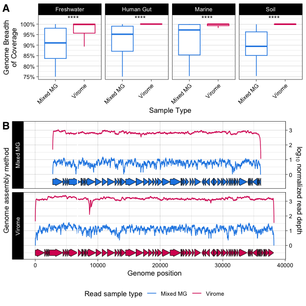

Figure 4, Table S4, Table S5
================
James C. Kosmopoulos
2023-12-05

# Load packages

``` r
library(tidyverse); packageVersion("tidyverse")
```

    ## [1] '2.0.0'

``` r
library(ggforce); packageVersion("ggforce")
```

    ## [1] '0.4.1'

``` r
library(gggenes); packageVersion("gggenes")
```

    ## [1] '0.5.1'

# Load data and features

``` r
data_reform <- readRDS("../Data/stats_and_metadata.RDS")
depth_per_base <- readRDS("../Data/depth_per_base.RDS")
features <- readRDS("../Data/features_combined.RDS")
rect <- readRDS("../Data/features_absent.RDS")
```

# Table S4

``` r
tableS4 <- features[ c("Genome", "contig",  "gene", "start", "stop", "start.relative",  "stop.relative", "frame", "phrog", "Method", "annot", "category")]
tableS4$sample <- sub("__.*", "", tableS4$Genome) # add a sample column
tableS4 <- tableS4[c(1, ncol(tableS4), 2:(ncol(tableS4)-1))] # move sample column to second position
tableS4 <- merge(tableS4, data_reform[c("Sample", "Environment")], by.x = "sample", by.y = "Sample")
col_order <- c("Genome", "sample", "Environment", setdiff(names(tableS4), c("Genome", "sample", "Environment")))
tableS4 <- tableS4[col_order]
write_csv(tableS4, file="../Tables/TableS4.csv")
head(tableS4)
```

    ##                          Genome    sample Environment
    ## 1 Ga0485172__vRhyme_unbinned_38 Ga0485172  freshwater
    ## 2 Ga0485172__vRhyme_unbinned_38 Ga0485172  freshwater
    ## 3 Ga0485172__vRhyme_unbinned_38 Ga0485172  freshwater
    ## 4 Ga0485172__vRhyme_unbinned_38 Ga0485172  freshwater
    ## 5 Ga0485172__vRhyme_unbinned_38 Ga0485172  freshwater
    ## 6 Ga0485172__vRhyme_unbinned_38 Ga0485172  freshwater
    ##                                                     contig              gene
    ## 1 vRhyme_unbinned_38__Ga0485172_0000163_reverse_complement VXJRLFAH_CDS_0001
    ## 2 vRhyme_unbinned_38__Ga0485172_0000163_reverse_complement VXJRLFAH_CDS_0002
    ## 3 vRhyme_unbinned_38__Ga0485172_0000163_reverse_complement VXJRLFAH_CDS_0003
    ## 4 vRhyme_unbinned_38__Ga0485172_0000163_reverse_complement VXJRLFAH_CDS_0004
    ## 5 vRhyme_unbinned_38__Ga0485172_0000163_reverse_complement VXJRLFAH_CDS_0005
    ## 6 vRhyme_unbinned_38__Ga0485172_0000163_reverse_complement VXJRLFAH_CDS_0006
    ##   start stop start.relative stop.relative frame    phrog    Method
    ## 1     1 1653           2789          4441     +      156 PHANOTATE
    ## 2  1650 2012           4438          4800     +      858 PHANOTATE
    ## 3  2016 2318           4804          5106     + No_PHROG PHANOTATE
    ## 4  2318 2551           5106          5339     + No_PHROG PHANOTATE
    ## 5  2563 4527           5351          7315     +    22896 PHANOTATE
    ## 6  4524 4667           7312          7455     + No_PHROG PHANOTATE
    ##                                            annot                 category
    ## 1                                 portal protein       head and packaging
    ## 2 starvation-inducible transcriptional regulator transcription regulation
    ## 3                           hypothetical protein         unknown function
    ## 4                           hypothetical protein         unknown function
    ## 5                                   tail protein                     tail
    ## 6                           hypothetical protein         unknown function

# Table S5

``` r
tableS5 <- depth_per_base[ c("Contig",  "Position", "Depth",    "Relative.position",    "Read.sample",  "Read.sample.method",   "Genome.method",    "Genome")]
reads_paired_Ga0485184 <- data_reform[which(data_reform$Sample == "Ga0485184"),]$Reads_paired_reads[1]
reads_paired_Ga0485172 <- data_reform[which(data_reform$Sample == "Ga0485172"),]$Reads_paired_reads[1]
tableS5$Filtered.read.pairs.in.sample <- ifelse(tableS5$Read.sample == "Ga0485184", 
                                                reads_paired_Ga0485184, 
                                                ifelse(tableS5$Read.sample == "Ga0485172", 
                                                       reads_paired_Ga0485172, 
                                                       NA))
                             
tableS5$Depth.per.100M.reads <- depth_per_base$Depth.per.100M.reads
tableS5$Depth.normalized <- depth_per_base$Depth.normalized
write_csv(tableS5, file="../Tables/TableS5.csv")
head(tableS5)
```

    ##                                  Contig Position Depth Relative.position
    ## 1 vRhyme_unbinned_38__Ga0485172_0000163        3     3              2791
    ## 2 vRhyme_unbinned_38__Ga0485172_0000163        4     3              2792
    ## 3 vRhyme_unbinned_38__Ga0485172_0000163        5     3              2793
    ## 4 vRhyme_unbinned_38__Ga0485172_0000163        6     3              2794
    ## 5 vRhyme_unbinned_38__Ga0485172_0000163        7     3              2795
    ## 6 vRhyme_unbinned_38__Ga0485172_0000163        8     4              2796
    ##   Read.sample Read.sample.method Genome.method                        Genome
    ## 1   Ga0485184           Mixed MG      Mixed MG Ga0485172__vRhyme_unbinned_38
    ## 2   Ga0485184           Mixed MG      Mixed MG Ga0485172__vRhyme_unbinned_38
    ## 3   Ga0485184           Mixed MG      Mixed MG Ga0485172__vRhyme_unbinned_38
    ## 4   Ga0485184           Mixed MG      Mixed MG Ga0485172__vRhyme_unbinned_38
    ## 5   Ga0485184           Mixed MG      Mixed MG Ga0485172__vRhyme_unbinned_38
    ## 6   Ga0485184           Mixed MG      Mixed MG Ga0485172__vRhyme_unbinned_38
    ##   Filtered.read.pairs.in.sample Depth.per.100M.reads Depth.normalized
    ## 1                     277298408             1.081867       0.03417388
    ## 2                     277298408             1.081867       0.03417388
    ## 3                     277298408             1.081867       0.03417388
    ## 4                     277298408             1.081867       0.03417388
    ## 5                     277298408             1.081867       0.03417388
    ## 6                     277298408             1.442489       0.15911262

# Figure 4

``` r
# Define the offset for assembly B
offset_B <- 2789

# Define the range that is missing in assembly B
missing_range_start <- 6822 # Reversed
missing_range_end <- 6692 # Reversed
additional_missing_start <- 3905
additional_missing_end <- 3908

ggenes <- ggplot() +
  geom_gene_arrow(data = features, aes(xmin = start.relative, xmax = stop.relative, y = -0.5, fill = Genome.method)) +
  geom_line(data=depth_per_base %>%
              mutate(Depth.normalized = if_else(Depth.normalized < 0, 0, Depth.normalized)),
            aes(x=Relative.position, y=Depth.normalized, color=Read.sample.method)) +
  facet_grid(rows=vars(Genome.method), switch="both") +
  scale_y_continuous(sec.axis = sec_axis(~ . , name = "Genome assembly method", breaks = NULL, labels = NULL), position = "right",) +
  scale_color_manual(name= "Read sample method", values = c("Virome" = "#D81B60", "Mixed MG" = "#1E88E5")) +
  theme_linedraw() +
  theme(legend.position = "bottom") +
  ylab(expression(log[10]~normalized~read~depth)) +
  xlab("Genome position") +
  scale_fill_manual(name= "Method", values = c("Virome" = "#D81B60", "Mixed MG" = "#1E88E5")) +
  guides(fill="none") +
  annotate(
    "rect",
    xmin = missing_range_start,
    xmax = missing_range_end,
    ymin = -.75,
    ymax = max(depth_per_base$Depth.normalized),
    fill = "white",
    alpha = 1
  )
ggenes
```

<!-- -->

``` r
ggsave("../Plots/Fig4.png", plot=ggenes, device = "png", width = 6.5, height = 4, units = "in", dpi = 600, scale = 1)
```

**Note that this figure was later modified, manually, to add highlighted
regions and coloring for a selection of genes of interest.**
