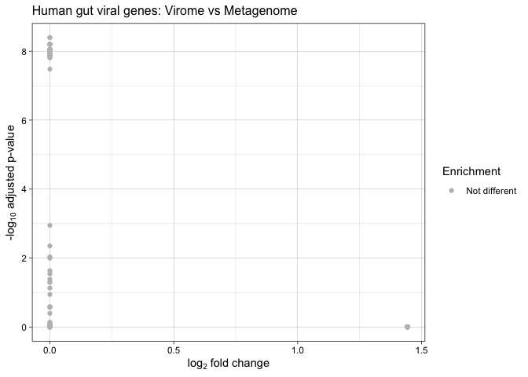
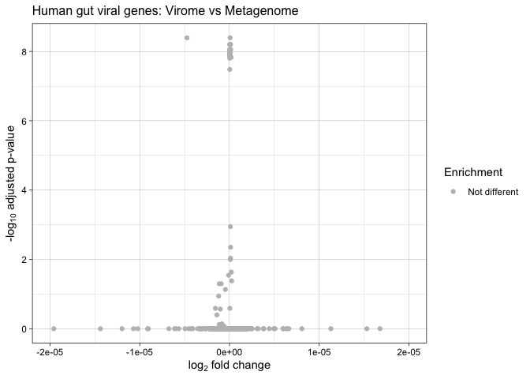
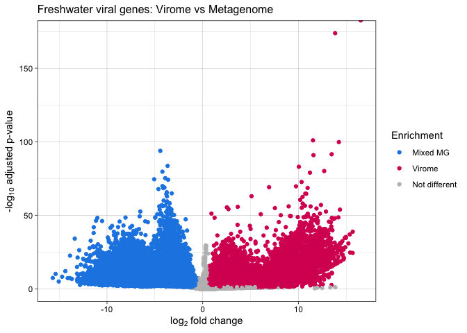
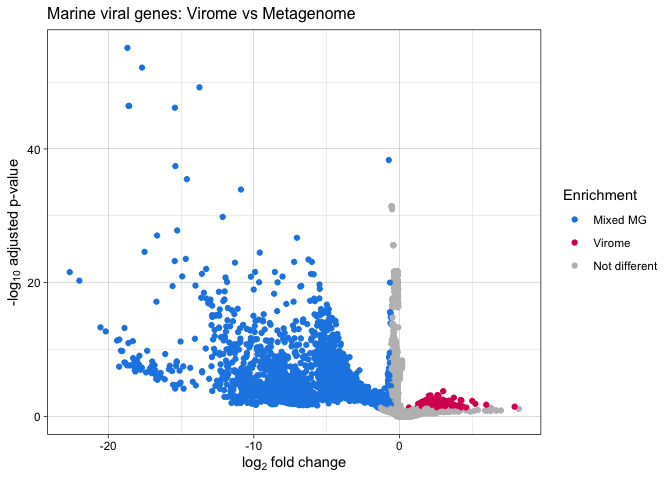
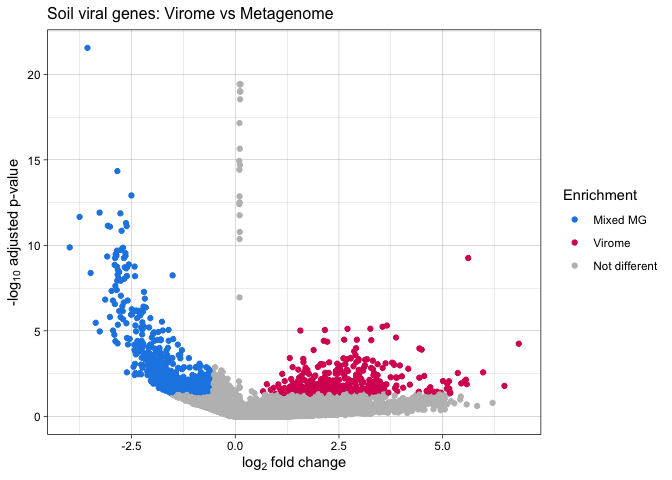
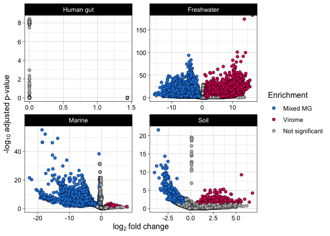
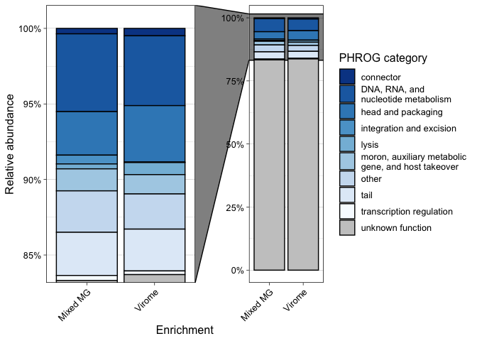
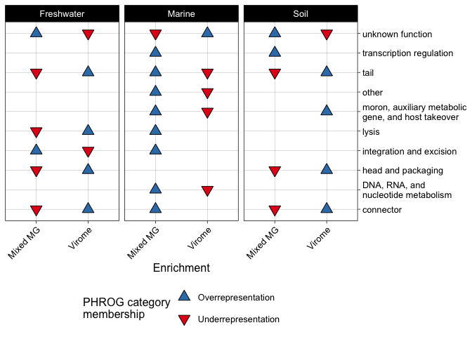
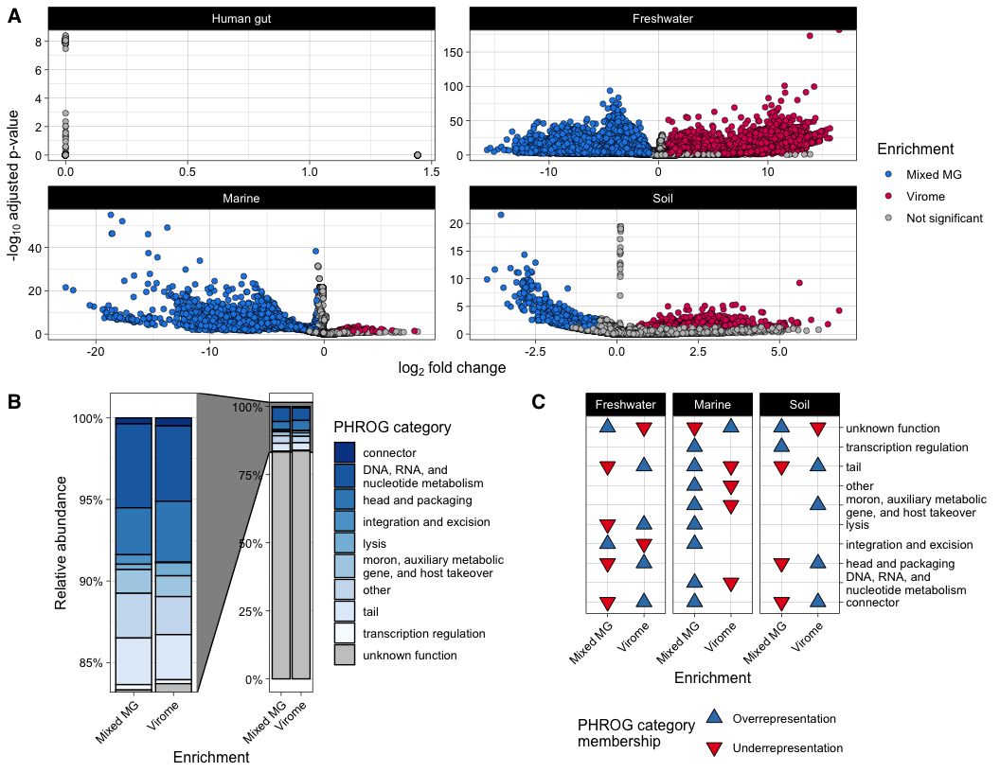

Figure 5, Table S2, Table S3
================
James C. Kosmopoulos
2023-12-06

# Load packages

``` r
library(tidyverse); packageVersion("tidyverse")
```

    ## [1] '2.0.0'

``` r
library(DESeq2); packageVersion("DESeq2")
```

    ## [1] '1.40.2'

``` r
library(ggrepel); packageVersion("ggrepel")
```

    ## [1] '0.9.3'

``` r
library(RColorBrewer); packageVersion("RColorBrewer")
```

    ## [1] '1.1.3'

``` r
library(ggforce); packageVersion("ggforce")
```

    ## [1] '0.4.1'

# Load data

``` r
counts.gut <- readRDS('../Data/gene_counts_human_gut.RDS')
counts.fw <- readRDS('../Data/gene_counts_freshwater.RDS')
counts.mar <- readRDS('../Data/gene_counts_marine.RDS')
counts.soil <- readRDS('../Data/gene_counts_soil.RDS')
metadata <- readRDS("../Data/TableS1.RDS")
metadata <- metadata[, 1:4]
colnames(metadata) <- c("Sample", "Sample.source", "Environment", "Method")
rownames(metadata) <- metadata$Sample
metadata.gut <- subset(metadata, Environment=="Human gut")
metadata.fw <- subset(metadata, Environment=="Freshwater")
metadata.mar <- subset(metadata, Environment=="Marine")
metadata.soil <- subset(metadata, Environment=="Soil")
```

# Creating a DESeq2 object and normalizing counts

## Make sure that the order of column names in the counts table is the same as the order of rownames for the metadata

``` r
# reorder metadata's columns based on row order of the counts  
metadata.gut <- metadata.gut[colnames(counts.gut), ]
all(colnames(counts.gut) == rownames(metadata.gut))
```

    ## [1] TRUE

``` r
metadata.gut
```

    ##                Sample Sample.source Environment   Method
    ## SRR9162900 SRR9162900    APC055_920   Human gut Mixed MG
    ## SRR9161506 SRR9161506    APC055_919   Human gut   Virome
    ## SRR9161509 SRR9161509    APC055_925   Human gut   Virome
    ## SRR9161503 SRR9161503    APC055_922   Human gut   Virome
    ## SRR9162908 SRR9162908    APC055_924   Human gut Mixed MG
    ## SRR9162903 SRR9162903    APC055_917   Human gut Mixed MG
    ## SRR9162902 SRR9162902    APC055_922   Human gut Mixed MG
    ## SRR9161501 SRR9161501    APC055_920   Human gut   Virome
    ## SRR9162899 SRR9162899    APC055_921   Human gut Mixed MG
    ## SRR9161504 SRR9161504    APC055_917   Human gut   Virome
    ## SRR9162904 SRR9162904    APC055_916   Human gut Mixed MG
    ## SRR9161505 SRR9161505    APC055_916   Human gut   Virome
    ## SRR9162907 SRR9162907    APC055_925   Human gut Mixed MG
    ## SRR9161507 SRR9161507    APC055_918   Human gut   Virome
    ## SRR9162906 SRR9162906    APC055_918   Human gut Mixed MG
    ## SRR9162901 SRR9162901    APC055_923   Human gut Mixed MG
    ## SRR9161510 SRR9161510    APC055_924   Human gut   Virome
    ## SRR9161502 SRR9161502    APC055_923   Human gut   Virome
    ## SRR9162905 SRR9162905    APC055_919   Human gut Mixed MG
    ## SRR9161500 SRR9161500    APC055_921   Human gut   Virome

``` r
metadata.fw <- metadata.fw[colnames(counts.fw), ]
all(colnames(counts.fw) == rownames(metadata.fw))
```

    ## [1] TRUE

``` r
metadata.mar <- metadata.mar[colnames(counts.mar), ]
all(colnames(counts.mar) == rownames(metadata.mar))
```

    ## [1] TRUE

``` r
metadata.mar
```

    ##              Sample Sample.source Environment   Method
    ## ERR594382 ERR594382  TARA_065_DCM      Marine   Virome
    ## ERR599146 ERR599146  TARA_065_SRF      Marine Mixed MG
    ## ERR594411 ERR594411  TARA_078_SRF      Marine   Virome
    ## ERR594362 ERR594362  TARA_066_SRF      Marine   Virome
    ## ERR598984 ERR598984  TARA_072_SRF      Marine Mixed MG
    ## ERR599006 ERR599006  TARA_078_SRF      Marine Mixed MG
    ## ERR599173 ERR599173  TARA_066_SRF      Marine Mixed MG
    ## ERR594377 ERR594377  TARA_085_DCM      Marine   Virome
    ## ERR599144 ERR599144  TARA_067_SRF      Marine Mixed MG
    ## ERR594392 ERR594392  TARA_064_SRF      Marine   Virome
    ## ERR594391 ERR594391  TARA_068_SRF      Marine   Virome
    ## ERR599165 ERR599165  TARA_070_SRF      Marine Mixed MG
    ## ERR594354 ERR594354  TARA_076_SRF      Marine   Virome
    ## ERR599110 ERR599110  TARA_065_DCM      Marine Mixed MG
    ## ERR599174 ERR599174  TARA_068_SRF      Marine Mixed MG
    ## ERR594355 ERR594355  TARA_076_DCM      Marine   Virome
    ## ERR594388 ERR594388  TARA_072_MES      Marine   Virome
    ## ERR594353 ERR594353  TARA_070_SRF      Marine   Virome
    ## ERR599065 ERR599065  TARA_109_DCM      Marine Mixed MG
    ## ERR599122 ERR599122  TARA_082_DCM      Marine Mixed MG
    ## ERR599044 ERR599044  TARA_070_MES      Marine Mixed MG
    ## ERR599133 ERR599133  TARA_072_DCM      Marine Mixed MG
    ## ERR594409 ERR594409  TARA_082_DCM      Marine   Virome
    ## ERR599148 ERR599148  TARA_076_DCM      Marine Mixed MG
    ## ERR599017 ERR599017  TARA_068_DCM      Marine Mixed MG
    ## ERR599023 ERR599023  TARA_064_DCM      Marine Mixed MG
    ## ERR594379 ERR594379  TARA_072_DCM      Marine   Virome
    ## ERR599126 ERR599126  TARA_076_SRF      Marine Mixed MG
    ## ERR599118 ERR599118  TARA_109_SRF      Marine Mixed MG
    ## ERR594364 ERR594364  TARA_072_SRF      Marine   Virome
    ## ERR594389 ERR594389  TARA_066_DCM      Marine   Virome
    ## ERR594415 ERR594415  TARA_068_DCM      Marine   Virome
    ## ERR594380 ERR594380  TARA_109_DCM      Marine   Virome
    ## ERR594407 ERR594407  TARA_070_MES      Marine   Virome
    ## ERR594404 ERR594404  TARA_067_SRF      Marine   Virome
    ## ERR599150 ERR599150  TARA_064_SRF      Marine Mixed MG
    ## ERR598982 ERR598982  TARA_066_DCM      Marine Mixed MG
    ## ERR599121 ERR599121  TARA_085_DCM      Marine Mixed MG
    ## ERR594385 ERR594385  TARA_064_DCM      Marine   Virome
    ## ERR594412 ERR594412  TARA_109_SRF      Marine   Virome
    ## ERR594359 ERR594359  TARA_065_SRF      Marine   Virome
    ## ERR599005 ERR599005  TARA_072_MES      Marine Mixed MG

``` r
metadata.soil <- metadata.soil[colnames(counts.soil), ]
all(colnames(counts.soil) == rownames(metadata.soil))
```

    ## [1] TRUE

``` r
metadata.soil
```

    ##                Sample           Sample.source Environment   Method
    ## SRR8487032 SRR8487032 B3R2H_L006_pre-planting        Soil Mixed MG
    ## SRR8487034 SRR8487034      B8R2H_L006_harvest        Soil   Virome
    ## SRR8487037 SRR8487037 B8R2H_L006_pre-planting        Soil Mixed MG
    ## SRR8487027 SRR8487027        B0L_L006_harvest        Soil Mixed MG
    ## SRR8487038 SRR8487038 B8R2L_L006_pre-planting        Soil Mixed MG
    ## SRR8487024 SRR8487024   B0H_L006_pre-planting        Soil Mixed MG
    ## SRR8487036 SRR8487036        B0L_L006_harvest        Soil   Virome
    ## SRR8487030 SRR8487030      B2R2H_L006_harvest        Soil Mixed MG
    ## SRR8487040 SRR8487040      B3R2L_L006_harvest        Soil Mixed MG
    ## SRR8487025 SRR8487025   B0L_L006_pre-planting        Soil Mixed MG
    ## SRR8487011 SRR8487011   B0L_L006_pre-planting        Soil   Virome
    ## SRR8487010 SRR8487010   B0H_L006_pre-planting        Soil   Virome
    ## SRR8487018 SRR8487018      B3R2H_L006_harvest        Soil   Virome
    ## SRR8487016 SRR8487016 B2R2L_L006_pre-planting        Soil   Virome
    ## SRR8487035 SRR8487035        B0H_L006_harvest        Soil   Virome
    ## SRR8487023 SRR8487023      B8R2L_L006_harvest        Soil   Virome
    ## SRR8487019 SRR8487019 B8R2L_L006_pre-planting        Soil   Virome
    ## SRR8487026 SRR8487026        B0H_L006_harvest        Soil Mixed MG
    ## SRR8487028 SRR8487028 B2R2H_L006_pre-planting        Soil Mixed MG
    ## SRR8487021 SRR8487021      B3R2L_L006_harvest        Soil   Virome
    ## SRR8487020 SRR8487020 B3R2H_L006_pre-planting        Soil   Virome
    ## SRR8487039 SRR8487039      B3R2H_L006_harvest        Soil Mixed MG
    ## SRR8487031 SRR8487031      B2R2L_L006_harvest        Soil Mixed MG
    ## SRR8487015 SRR8487015      B2R2H_L006_harvest        Soil   Virome
    ## SRR8487029 SRR8487029 B2R2L_L006_pre-planting        Soil Mixed MG
    ## SRR8487017 SRR8487017 B2R2H_L006_pre-planting        Soil   Virome
    ## SRR8487013 SRR8487013      B8R2L_L006_harvest        Soil Mixed MG
    ## SRR8487012 SRR8487012      B8R2H_L006_harvest        Soil Mixed MG
    ## SRR8487014 SRR8487014      B2R2L_L006_harvest        Soil   Virome
    ## SRR8487022 SRR8487022 B8R2H_L006_pre-planting        Soil   Virome

## Make DESeq objects

### Human gut

``` r
dds.gut <- DESeqDataSetFromMatrix(countData=counts.gut,
                                  colData=metadata.gut,
                                  design= ~Sample.source + Method)
dds.gut
```

    ## class: DESeqDataSet 
    ## dim: 13099 20 
    ## metadata(1): version
    ## assays(1): counts
    ## rownames(13099): vRhyme_unbinned_19__SRR9162906_435_1
    ##   vRhyme_unbinned_19__SRR9162906_435_3 ...
    ##   vRhyme_bin_9__SRR9161500_478_26 vRhyme_bin_9__SRR9161500_478_29
    ## rowData names(0):
    ## colnames(20): SRR9162900 SRR9161506 ... SRR9162905 SRR9161500
    ## colData names(4): Sample Sample.source Environment Method

### Freshwater

``` r
dds.fw <- DESeqDataSetFromMatrix(countData=counts.fw,
                                  colData=metadata.fw,
                                  design= ~Sample.source + Method)
dds.fw
```

    ## class: DESeqDataSet 
    ## dim: 206127 28 
    ## metadata(1): version
    ## assays(1): counts
    ## rownames(206127): vRhyme_unbinned_369__Ga0485159_0000068_5
    ##   vRhyme_unbinned_369__Ga0485159_0000068_9 ...
    ##   vRhyme_unbinned_942__Ga0485175_0000977_39
    ##   vRhyme_unbinned_499__Ga0485175_0004773_5
    ## rowData names(0):
    ## colnames(28): Ga0485173 Ga0485185 ... Ga0485183 Ga0485179
    ## colData names(4): Sample Sample.source Environment Method

### Marine

``` r
dds.mar <- DESeqDataSetFromMatrix(countData=counts.mar,
                                  colData=metadata.mar,
                                  design= ~Sample.source + Method)
dds.mar
```

    ## class: DESeqDataSet 
    ## dim: 116900 42 
    ## metadata(1): version
    ## assays(1): counts
    ## rownames(116900):
    ##   vRhyme_unbinned_19__NODE_79_length_37623_cov_0.132795_fragment_1_30
    ##   vRhyme_unbinned_19__NODE_79_length_37623_cov_0.132795_fragment_1_32
    ##   ... vRhyme_unbinned_595__NODE_652_length_16559_cov_0.247570_13
    ##   vRhyme_unbinned_595__NODE_652_length_16559_cov_0.247570_15
    ## rowData names(0):
    ## colnames(42): ERR594382 ERR599146 ... ERR594359 ERR599005
    ## colData names(4): Sample Sample.source Environment Method

### Soil

``` r
dds.soil <- DESeqDataSetFromMatrix(countData=counts.soil,
                                  colData=metadata.soil,
                                  design= ~Sample.source + Method)
dds.soil
```

    ## class: DESeqDataSet 
    ## dim: 78654 30 
    ## metadata(1): version
    ## assays(1): counts
    ## rownames(78654): vRhyme_bin_2__SRR8487012_24_5
    ##   vRhyme_bin_2__SRR8487012_24_6 ...
    ##   vRhyme_unbinned_522__SRR8487017_640_12
    ##   vRhyme_unbinned_499__SRR8487017_527_12
    ## rowData names(0):
    ## colnames(30): SRR8487032 SRR8487034 ... SRR8487014 SRR8487022
    ## colData names(4): Sample Sample.source Environment Method

# Differential abundance (DA)

## DA genes: human gut samples

``` r
dds.gut <- DESeq(dds.gut, test="Wald")
resultsNames(dds.gut)
```

    ##  [1] "Intercept"                             
    ##  [2] "Sample.source_APC055_917_vs_APC055_916"
    ##  [3] "Sample.source_APC055_918_vs_APC055_916"
    ##  [4] "Sample.source_APC055_919_vs_APC055_916"
    ##  [5] "Sample.source_APC055_920_vs_APC055_916"
    ##  [6] "Sample.source_APC055_921_vs_APC055_916"
    ##  [7] "Sample.source_APC055_922_vs_APC055_916"
    ##  [8] "Sample.source_APC055_923_vs_APC055_916"
    ##  [9] "Sample.source_APC055_924_vs_APC055_916"
    ## [10] "Sample.source_APC055_925_vs_APC055_916"
    ## [11] "Method_Virome_vs_Mixed.MG"

### Get results from virome vs metagenome contrast

``` r
res.gut.vir.mg <- results(dds.gut, contrast = c("Method", "Virome", "Mixed MG"), alpha = 0.05) # Baseline is metagenome
head(res.gut.vir.mg  %>% as.data.frame())
```

    ##                                          baseMean log2FoldChange    lfcSE
    ## vRhyme_unbinned_19__SRR9162906_435_1   0.05868323      -1.653403 3.019465
    ## vRhyme_unbinned_19__SRR9162906_435_3  61.97858101      -1.824828 1.266947
    ## vRhyme_unbinned_19__SRR9162906_435_13  4.19794916      -3.998467 2.978244
    ## vRhyme_unbinned_53__SRR9162906_141_2   0.63560914      -1.821989 2.997018
    ## vRhyme_unbinned_53__SRR9162906_141_3   0.17604968      -1.805527 3.013585
    ## vRhyme_unbinned_53__SRR9162906_141_14  0.06303297      -1.536720 3.016680
    ##                                             stat    pvalue     padj
    ## vRhyme_unbinned_19__SRR9162906_435_1  -0.5475816 0.5839792 0.999406
    ## vRhyme_unbinned_19__SRR9162906_435_3  -1.4403345 0.1497728 0.999406
    ## vRhyme_unbinned_19__SRR9162906_435_13 -1.3425586 0.1794149 0.999406
    ## vRhyme_unbinned_53__SRR9162906_141_2  -0.6079340 0.5432312 0.999406
    ## vRhyme_unbinned_53__SRR9162906_141_3  -0.5991294 0.5490866 0.999406
    ## vRhyme_unbinned_53__SRR9162906_141_14 -0.5094077 0.6104665 0.999406

### Shrunken log2 foldchanges (LFC)

``` r
res.gut.vir.mg.unshrunken <- res.gut.vir.mg # Save the unshrunken results to compare
res.gut.vir.mg <- lfcShrink(dds.gut, coef="Method_Virome_vs_Mixed.MG")
```

### Summarize results

``` r
summary(res.gut.vir.mg, alpha = 0.05)
```

    ## 
    ## out of 12577 with nonzero total read count
    ## adjusted p-value < 0.05
    ## LFC > 0 (up)       : 53, 0.42%
    ## LFC < 0 (down)     : 2, 0.016%
    ## outliers [1]       : 0, 0%
    ## low counts [2]     : 0, 0%
    ## (mean count < 0)
    ## [1] see 'cooksCutoff' argument of ?results
    ## [2] see 'independentFiltering' argument of ?results

### Save results

``` r
res.gut.vir.mg_tb <- res.gut.vir.mg %>%
  as.data.frame() %>%
  rownames_to_column(var="Gene") %>% 
  as_tibble()
head(res.gut.vir.mg_tb)
```

    ## # A tibble: 6 × 6
    ##   Gene                              baseMean log2FoldChange   lfcSE pvalue  padj
    ##   <chr>                                <dbl>          <dbl>   <dbl>  <dbl> <dbl>
    ## 1 vRhyme_unbinned_19__SRR9162906_4…   0.0587  -0.0000000604 0.00144  0.584 0.999
    ## 2 vRhyme_unbinned_19__SRR9162906_4…  62.0     -0.000000760  0.00144  0.150 0.999
    ## 3 vRhyme_unbinned_19__SRR9162906_4…   4.20    -0.000000324  0.00144  0.179 0.999
    ## 4 vRhyme_unbinned_53__SRR9162906_1…   0.636   -0.0000000944 0.00144  0.543 0.999
    ## 5 vRhyme_unbinned_53__SRR9162906_1…   0.176   -0.0000000556 0.00144  0.549 0.999
    ## 6 vRhyme_unbinned_53__SRR9162906_1…   0.0630  -0.0000000313 0.00144  0.610 0.999

### Extract significant results

``` r
sig.res.gut.vir.mg <- res.gut.vir.mg_tb %>% filter(padj < 0.05)
head(sig.res.gut.vir.mg)
```

    ## # A tibble: 6 × 6
    ##   Gene                          baseMean log2FoldChange   lfcSE   pvalue    padj
    ##   <chr>                            <dbl>          <dbl>   <dbl>    <dbl>   <dbl>
    ## 1 vRhyme_unbinned_21__SRR91615…    101.    0.0000000348 0.00144 1.26e-11 8.76e-9
    ## 2 vRhyme_unbinned_21__SRR91615…     59.1   0.0000000776 0.00144 3.07e-11 1.17e-8
    ## 3 vRhyme_unbinned_21__SRR91615…     82.7   0.0000000352 0.00144 1.76e-11 9.09e-9
    ## 4 vRhyme_unbinned_21__SRR91615…     55.0   0.0000000214 0.00144 4.13e-11 1.32e-8
    ## 5 vRhyme_unbinned_21__SRR91615…     40.6   0.0000000325 0.00144 5.86e-11 1.57e-8
    ## 6 vRhyme_unbinned_21__SRR91615…     75.1   0.0000000330 0.00144 2.09e-11 9.33e-9

``` r
nrow(sig.res.gut.vir.mg)
```

    ## [1] 55

### Set p-value and fold change criteria

``` r
lfc.cutoff <- 0.58 # We are working with log2 fold changes so 0.58 translates to an actual fold change of 1.5
res.gut.vir.mg_tb <- res.gut.vir.mg_tb %>% mutate(threshold_ViromeVsMetagenome = padj < 0.05 & abs(log2FoldChange) >= lfc.cutoff)
```

### Make labels for the genes meeting the cutoff

``` r
res.gut.vir.mg_tb$label <- res.gut.vir.mg_tb$Gene
res.gut.vir.mg_tb <- res.gut.vir.mg_tb %>% mutate(label = case_when(threshold_ViromeVsMetagenome == TRUE ~ c(label, NULL)))
res.gut.vir.mg_tb <- res.gut.vir.mg_tb %>% mutate(Enrichment = case_when(
  (threshold_ViromeVsMetagenome == TRUE & log2FoldChange < 0) ~ "Mixed MG",
  (threshold_ViromeVsMetagenome == TRUE & log2FoldChange > 0) ~ "Virome",
  (threshold_ViromeVsMetagenome == FALSE | is.na(threshold_ViromeVsMetagenome) == TRUE) ~ "Not different")
  )
res.gut.vir.mg_tb$Enrichment <- factor(res.gut.vir.mg_tb$Enrichment, levels = c("Mixed MG", "Virome", "Not different"))
```

### Volcano plot

``` r
volcano.gut.vir.mg <- ggplot(res.gut.vir.mg_tb, aes(x = log2FoldChange, y = -log10(padj))) +
                              geom_point(aes(color = Enrichment)) +
                              scale_color_manual(name= "Enrichment", values = c("Virome" = "#D81B60", "Mixed MG" = "#1E88E5", "Not different" = "grey")) +
                              xlab(expression(log[2]~fold~change)) + 
                              ylab(expression("-"*log[10]~adjusted~"p-"*value)) +
                              theme_linedraw() +
                              ggtitle("Human gut viral genes: Virome vs Metagenome") +
                              theme(legend.position = "right", plot.title = element_text(size = 12))
volcano.gut.vir.mg
```

<!-- -->

### Re-plot without extreme values

``` r
volcano.gut.vir.mg.no.extreme <- volcano.gut.vir.mg + xlim(-2e-5, 2e-5)
volcano.gut.vir.mg.no.extreme
```

<!-- -->

## DA genes: freshwater samples

``` r
dds.fw <- DESeq(dds.fw, test="Wald")
resultsNames(dds.fw)
```

    ##  [1] "Intercept"                                             
    ##  [2] "Sample.source_ME_2020.07.24_23.5m_vs_ME_2020.07.24_15m"
    ##  [3] "Sample.source_ME_2020.07.24_5m_vs_ME_2020.07.24_15m"   
    ##  [4] "Sample.source_ME_2020.08.05_15m_vs_ME_2020.07.24_15m"  
    ##  [5] "Sample.source_ME_2020.08.05_23.5m_vs_ME_2020.07.24_15m"
    ##  [6] "Sample.source_ME_2020.08.25_15m_vs_ME_2020.07.24_15m"  
    ##  [7] "Sample.source_ME_2020.08.25_23.5m_vs_ME_2020.07.24_15m"
    ##  [8] "Sample.source_ME_2020.09.11_15m_vs_ME_2020.07.24_15m"  
    ##  [9] "Sample.source_ME_2020.09.11_23.5m_vs_ME_2020.07.24_15m"
    ## [10] "Sample.source_ME_2020.10.08_15m_vs_ME_2020.07.24_15m"  
    ## [11] "Sample.source_ME_2020.10.08_23.5m_vs_ME_2020.07.24_15m"
    ## [12] "Sample.source_ME_2020.10.19_15m_vs_ME_2020.07.24_15m"  
    ## [13] "Sample.source_ME_2020.10.19_23.5m_vs_ME_2020.07.24_15m"
    ## [14] "Sample.source_ME_2020.10.19_5m_vs_ME_2020.07.24_15m"   
    ## [15] "Method_Virome_vs_Mixed.MG"

### Get results from virome vs metagenome contrast

``` r
res.fw.vir.mg <- results(dds.fw, contrast = c("Method", "Virome", "Mixed MG"), alpha = 0.05) # Baseline is metagenome
head(res.fw.vir.mg  %>% as.data.frame())
```

    ##                                            baseMean log2FoldChange     lfcSE
    ## vRhyme_unbinned_369__Ga0485159_0000068_5  42.559032      -2.174428 1.7475568
    ## vRhyme_unbinned_369__Ga0485159_0000068_9  94.656477      -1.035722 0.8167333
    ## vRhyme_unbinned_369__Ga0485159_0000068_11 16.079823      -2.071270 1.7150541
    ## vRhyme_unbinned_369__Ga0485159_0000068_14 16.340419      -1.430140 2.9649035
    ## vRhyme_unbinned_369__Ga0485159_0000068_22  6.341781      -1.965079 2.9721757
    ## vRhyme_unbinned_369__Ga0485159_0000068_29 17.143073      -1.199446 2.8226782
    ##                                                 stat    pvalue      padj
    ## vRhyme_unbinned_369__Ga0485159_0000068_5  -1.2442673 0.2134012 0.3970847
    ## vRhyme_unbinned_369__Ga0485159_0000068_9  -1.2681274 0.2047525 0.3845576
    ## vRhyme_unbinned_369__Ga0485159_0000068_11 -1.2076993 0.2271630 0.4163973
    ## vRhyme_unbinned_369__Ga0485159_0000068_14 -0.4823565 0.6295527 0.7918326
    ## vRhyme_unbinned_369__Ga0485159_0000068_22 -0.6611586 0.5085106 0.7121996
    ## vRhyme_unbinned_369__Ga0485159_0000068_29 -0.4249318 0.6708864 0.8151755

### Shrunken log2 foldchanges (LFC)

``` r
res.fw.vir.mg.unshrunken <- res.fw.vir.mg # Save the unshrunken results to compare
res.fw.vir.mg <- lfcShrink(dds.fw, coef="Method_Virome_vs_Mixed.MG")
res.fw.vir.mg
```

    ## log2 fold change (MAP): Method Virome vs Mixed.MG 
    ## Wald test p-value: Method Virome vs Mixed.MG 
    ## DataFrame with 206127 rows and 5 columns
    ##                                            baseMean log2FoldChange     lfcSE
    ##                                           <numeric>      <numeric> <numeric>
    ## vRhyme_unbinned_369__Ga0485159_0000068_5   42.55903     -0.1551291  0.988171
    ## vRhyme_unbinned_369__Ga0485159_0000068_9   94.65648     -0.4328090  0.789067
    ## vRhyme_unbinned_369__Ga0485159_0000068_11  16.07982     -0.2316521  1.001272
    ## vRhyme_unbinned_369__Ga0485159_0000068_14  16.34042      0.0729579  1.009151
    ## vRhyme_unbinned_369__Ga0485159_0000068_22   6.34178      0.0176697  1.004541
    ## ...                                             ...            ...       ...
    ## vRhyme_unbinned_942__Ga0485175_0000977_35    0.0000             NA        NA
    ## vRhyme_unbinned_942__Ga0485175_0000977_36   61.8306        1.10519  0.314475
    ## vRhyme_unbinned_942__Ga0485175_0000977_37   69.9357        1.24888  0.268347
    ## vRhyme_unbinned_942__Ga0485175_0000977_39   11.5814        1.91309  0.389246
    ## vRhyme_unbinned_499__Ga0485175_0004773_5   740.4070        1.54572  0.241930
    ##                                                pvalue        padj
    ##                                             <numeric>   <numeric>
    ## vRhyme_unbinned_369__Ga0485159_0000068_5     0.213401    0.403732
    ## vRhyme_unbinned_369__Ga0485159_0000068_9     0.204752    0.391026
    ## vRhyme_unbinned_369__Ga0485159_0000068_11    0.227163    0.423284
    ## vRhyme_unbinned_369__Ga0485159_0000068_14    0.629553    0.798447
    ## vRhyme_unbinned_369__Ga0485159_0000068_22    0.508511    0.720369
    ## ...                                               ...         ...
    ## vRhyme_unbinned_942__Ga0485175_0000977_35          NA          NA
    ## vRhyme_unbinned_942__Ga0485175_0000977_36 1.46339e-04 7.64077e-04
    ## vRhyme_unbinned_942__Ga0485175_0000977_37 1.16844e-06 9.47429e-06
    ## vRhyme_unbinned_942__Ga0485175_0000977_39 2.38754e-07 2.18732e-06
    ## vRhyme_unbinned_499__Ga0485175_0004773_5  8.01503e-12 1.45124e-10

### Summarize results

``` r
summary(res.fw.vir.mg, alpha = 0.05)
```

    ## 
    ## out of 204431 with nonzero total read count
    ## adjusted p-value < 0.05
    ## LFC > 0 (up)       : 38725, 19%
    ## LFC < 0 (down)     : 26274, 13%
    ## outliers [1]       : 0, 0%
    ## low counts [2]     : 11886, 5.8%
    ## (mean count < 1)
    ## [1] see 'cooksCutoff' argument of ?results
    ## [2] see 'independentFiltering' argument of ?results

### Save results

``` r
res.fw.vir.mg_tb <- res.fw.vir.mg %>%
  as.data.frame() %>%
  rownames_to_column(var="Gene") %>% 
  as_tibble()
head(res.fw.vir.mg_tb)
```

    ## # A tibble: 6 × 6
    ##   Gene                                baseMean log2FoldChange lfcSE pvalue  padj
    ##   <chr>                                  <dbl>          <dbl> <dbl>  <dbl> <dbl>
    ## 1 vRhyme_unbinned_369__Ga0485159_000…    42.6         -0.155  0.988  0.213 0.404
    ## 2 vRhyme_unbinned_369__Ga0485159_000…    94.7         -0.433  0.789  0.205 0.391
    ## 3 vRhyme_unbinned_369__Ga0485159_000…    16.1         -0.232  1.00   0.227 0.423
    ## 4 vRhyme_unbinned_369__Ga0485159_000…    16.3          0.0730 1.01   0.630 0.798
    ## 5 vRhyme_unbinned_369__Ga0485159_000…     6.34         0.0177 1.00   0.509 0.720
    ## 6 vRhyme_unbinned_369__Ga0485159_000…    17.1          0.0595 1.00   0.671 0.821

### Extract significant results

``` r
sig.res.fw.vir.mg <- res.fw.vir.mg_tb %>% filter(padj < 0.05)
head(sig.res.fw.vir.mg)
```

    ## # A tibble: 6 × 6
    ##   Gene                            baseMean log2FoldChange lfcSE   pvalue    padj
    ##   <chr>                              <dbl>          <dbl> <dbl>    <dbl>   <dbl>
    ## 1 vRhyme_unbinned_369__Ga0485159…    64.2          -1.25  1.00  1.26e- 2 3.88e-2
    ## 2 vRhyme_unbinned_221__Ga0485159…    15.3          -8.45  2.21  4.09e- 9 4.99e-8
    ## 3 vRhyme_unbinned_221__Ga0485159…     7.29         -7.16  4.89  1.11e- 3 4.66e-3
    ## 4 vRhyme_unbinned_88__Ga0485159_…    33.3          -0.803 0.363 1.32e- 2 4.04e-2
    ## 5 vRhyme_unbinned_88__Ga0485159_…    56.9          -1.47  0.238 1.77e-10 2.63e-9
    ## 6 vRhyme_unbinned_88__Ga0485159_…    11.1          -1.84  0.824 1.17e- 3 4.88e-3

``` r
nrow(sig.res.fw.vir.mg)
```

    ## [1] 64999

### Set p-value and fold change criteria

``` r
res.fw.vir.mg_tb <- res.fw.vir.mg_tb %>% mutate(threshold_ViromeVsMetagenome = padj < 0.05 & abs(log2FoldChange) >= lfc.cutoff)
```

### Make labels for the genes meeting the cutoff

``` r
res.fw.vir.mg_tb$label <- res.fw.vir.mg_tb$Gene
res.fw.vir.mg_tb <- res.fw.vir.mg_tb %>% mutate(label = case_when(threshold_ViromeVsMetagenome == TRUE ~ c(label, NULL)))
nrow(res.fw.vir.mg_tb[res.fw.vir.mg_tb$threshold_ViromeVsMetagenome == TRUE, ])
```

    ## [1] 65385

``` r
res.fw.vir.mg_tb <- res.fw.vir.mg_tb %>% mutate(Enrichment = case_when(
  (threshold_ViromeVsMetagenome == TRUE & log2FoldChange < 0) ~ "Mixed MG",
  (threshold_ViromeVsMetagenome == TRUE & log2FoldChange > 0) ~ "Virome",
  (threshold_ViromeVsMetagenome == FALSE | is.na(threshold_ViromeVsMetagenome) == TRUE) ~ "Not different")
  )
res.fw.vir.mg_tb$Enrichment <- factor(res.fw.vir.mg_tb$Enrichment, levels = c("Mixed MG", "Virome", "Not different"))
```

### Volcano plot

``` r
volcano.fw.vir.mg <- ggplot(res.fw.vir.mg_tb, aes(x = log2FoldChange, y = -log10(padj))) +
                              geom_point(aes(color = Enrichment)) +
                              scale_color_manual(name= "Enrichment", values = c("Virome" = "#D81B60", "Mixed MG" = "#1E88E5", "Not different" = "grey")) +
                              xlab(expression(log[2]~fold~change)) + 
                              ylab(expression("-"*log[10]~adjusted~"p-"*value)) +
                              theme_linedraw() +
                              ggtitle("Freshwater viral genes: Virome vs Metagenome") +
                              theme(legend.position = "right", plot.title = element_text(size = 12))
volcano.fw.vir.mg
```

<!-- -->

## DA genes: marine samples

``` r
dds.mar <- DESeq(dds.mar, test="Wald")
resultsNames(dds.mar)
```

    ##  [1] "Intercept"                                 
    ##  [2] "Sample.source_TARA_064_SRF_vs_TARA_064_DCM"
    ##  [3] "Sample.source_TARA_065_DCM_vs_TARA_064_DCM"
    ##  [4] "Sample.source_TARA_065_SRF_vs_TARA_064_DCM"
    ##  [5] "Sample.source_TARA_066_DCM_vs_TARA_064_DCM"
    ##  [6] "Sample.source_TARA_066_SRF_vs_TARA_064_DCM"
    ##  [7] "Sample.source_TARA_067_SRF_vs_TARA_064_DCM"
    ##  [8] "Sample.source_TARA_068_DCM_vs_TARA_064_DCM"
    ##  [9] "Sample.source_TARA_068_SRF_vs_TARA_064_DCM"
    ## [10] "Sample.source_TARA_070_MES_vs_TARA_064_DCM"
    ## [11] "Sample.source_TARA_070_SRF_vs_TARA_064_DCM"
    ## [12] "Sample.source_TARA_072_DCM_vs_TARA_064_DCM"
    ## [13] "Sample.source_TARA_072_MES_vs_TARA_064_DCM"
    ## [14] "Sample.source_TARA_072_SRF_vs_TARA_064_DCM"
    ## [15] "Sample.source_TARA_076_DCM_vs_TARA_064_DCM"
    ## [16] "Sample.source_TARA_076_SRF_vs_TARA_064_DCM"
    ## [17] "Sample.source_TARA_078_SRF_vs_TARA_064_DCM"
    ## [18] "Sample.source_TARA_082_DCM_vs_TARA_064_DCM"
    ## [19] "Sample.source_TARA_085_DCM_vs_TARA_064_DCM"
    ## [20] "Sample.source_TARA_109_DCM_vs_TARA_064_DCM"
    ## [21] "Sample.source_TARA_109_SRF_vs_TARA_064_DCM"
    ## [22] "Method_Virome_vs_Mixed.MG"

### Get results from virome vs metagenome contrast

``` r
res.mar.vir.mg <- results(dds.mar, contrast = c("Method", "Virome", "Mixed MG"), alpha = 0.05) # Baseline is metagenome
head(res.mar.vir.mg  %>% as.data.frame())
```

    ##                                                                      baseMean
    ## vRhyme_unbinned_19__NODE_79_length_37623_cov_0.132795_fragment_1_30 1091.3622
    ## vRhyme_unbinned_19__NODE_79_length_37623_cov_0.132795_fragment_1_32  485.8943
    ## vRhyme_unbinned_19__NODE_79_length_37623_cov_0.132795_fragment_1_33 1242.6105
    ## vRhyme_unbinned_19__NODE_79_length_37623_cov_0.132795_fragment_1_34  221.6439
    ## vRhyme_unbinned_8__NODE_256_length_20384_cov_0.136554_1              215.3021
    ## vRhyme_unbinned_8__NODE_256_length_20384_cov_0.136554_2              368.7347
    ##                                                                     log2FoldChange
    ## vRhyme_unbinned_19__NODE_79_length_37623_cov_0.132795_fragment_1_30     -30.000000
    ## vRhyme_unbinned_19__NODE_79_length_37623_cov_0.132795_fragment_1_32     -30.000000
    ## vRhyme_unbinned_19__NODE_79_length_37623_cov_0.132795_fragment_1_33     -30.000000
    ## vRhyme_unbinned_19__NODE_79_length_37623_cov_0.132795_fragment_1_34     -29.813438
    ## vRhyme_unbinned_8__NODE_256_length_20384_cov_0.136554_1                  -8.894627
    ## vRhyme_unbinned_8__NODE_256_length_20384_cov_0.136554_2                  -5.801924
    ##                                                                        lfcSE
    ## vRhyme_unbinned_19__NODE_79_length_37623_cov_0.132795_fragment_1_30 2.938926
    ## vRhyme_unbinned_19__NODE_79_length_37623_cov_0.132795_fragment_1_32 2.939343
    ## vRhyme_unbinned_19__NODE_79_length_37623_cov_0.132795_fragment_1_33 2.937537
    ## vRhyme_unbinned_19__NODE_79_length_37623_cov_0.132795_fragment_1_34 2.939086
    ## vRhyme_unbinned_8__NODE_256_length_20384_cov_0.136554_1             2.943083
    ## vRhyme_unbinned_8__NODE_256_length_20384_cov_0.136554_2             1.700659
    ##                                                                           stat
    ## vRhyme_unbinned_19__NODE_79_length_37623_cov_0.132795_fragment_1_30 -10.207811
    ## vRhyme_unbinned_19__NODE_79_length_37623_cov_0.132795_fragment_1_32 -10.206362
    ## vRhyme_unbinned_19__NODE_79_length_37623_cov_0.132795_fragment_1_33 -10.212636
    ## vRhyme_unbinned_19__NODE_79_length_37623_cov_0.132795_fragment_1_34 -10.143780
    ## vRhyme_unbinned_8__NODE_256_length_20384_cov_0.136554_1              -3.022214
    ## vRhyme_unbinned_8__NODE_256_length_20384_cov_0.136554_2              -3.411574
    ##                                                                           pvalue
    ## vRhyme_unbinned_19__NODE_79_length_37623_cov_0.132795_fragment_1_30 1.829463e-24
    ## vRhyme_unbinned_19__NODE_79_length_37623_cov_0.132795_fragment_1_32 1.856975e-24
    ## vRhyme_unbinned_19__NODE_79_length_37623_cov_0.132795_fragment_1_33 1.740710e-24
    ## vRhyme_unbinned_19__NODE_79_length_37623_cov_0.132795_fragment_1_34 3.531629e-24
    ## vRhyme_unbinned_8__NODE_256_length_20384_cov_0.136554_1             2.509333e-03
    ## vRhyme_unbinned_8__NODE_256_length_20384_cov_0.136554_2             6.458886e-04
    ##                                                                             padj
    ## vRhyme_unbinned_19__NODE_79_length_37623_cov_0.132795_fragment_1_30 3.369730e-22
    ## vRhyme_unbinned_19__NODE_79_length_37623_cov_0.132795_fragment_1_32 3.369730e-22
    ## vRhyme_unbinned_19__NODE_79_length_37623_cov_0.132795_fragment_1_33 3.369730e-22
    ## vRhyme_unbinned_19__NODE_79_length_37623_cov_0.132795_fragment_1_34 3.816571e-22
    ## vRhyme_unbinned_8__NODE_256_length_20384_cov_0.136554_1             2.491963e-02
    ## vRhyme_unbinned_8__NODE_256_length_20384_cov_0.136554_2             7.743522e-03

### Shrunken log2 foldchanges (LFC)

``` r
res.mar.vir.mg.unshrunken <- res.mar.vir.mg # Save the unshrunken results to compare
res.mar.vir.mg <- lfcShrink(dds.mar, coef="Method_Virome_vs_Mixed.MG")
res.mar.vir.mg
```

    ## log2 fold change (MAP): Method Virome vs Mixed.MG 
    ## Wald test p-value: Method Virome vs Mixed.MG 
    ## DataFrame with 116900 rows and 5 columns
    ##                                                                      baseMean
    ##                                                                     <numeric>
    ## vRhyme_unbinned_19__NODE_79_length_37623_cov_0.132795_fragment_1_30  1091.362
    ## vRhyme_unbinned_19__NODE_79_length_37623_cov_0.132795_fragment_1_32   485.894
    ## vRhyme_unbinned_19__NODE_79_length_37623_cov_0.132795_fragment_1_33  1242.611
    ## vRhyme_unbinned_19__NODE_79_length_37623_cov_0.132795_fragment_1_34   221.644
    ## vRhyme_unbinned_8__NODE_256_length_20384_cov_0.136554_1               215.302
    ## ...                                                                       ...
    ## vRhyme_bin_9__NODE_59_length_58436_cov_0.222175_20                   19.47028
    ## vRhyme_bin_9__NODE_59_length_58436_cov_0.222175_26                   52.02518
    ## vRhyme_bin_9__NODE_260_length_29908_cov_0.244020_16                   3.53225
    ## vRhyme_unbinned_595__NODE_652_length_16559_cov_0.247570_13            3.94332
    ## vRhyme_unbinned_595__NODE_652_length_16559_cov_0.247570_15           44.84346
    ##                                                                     log2FoldChange
    ##                                                                          <numeric>
    ## vRhyme_unbinned_19__NODE_79_length_37623_cov_0.132795_fragment_1_30      -0.300641
    ## vRhyme_unbinned_19__NODE_79_length_37623_cov_0.132795_fragment_1_32      -0.291953
    ## vRhyme_unbinned_19__NODE_79_length_37623_cov_0.132795_fragment_1_33      -0.323808
    ## vRhyme_unbinned_19__NODE_79_length_37623_cov_0.132795_fragment_1_34      -0.289168
    ## vRhyme_unbinned_8__NODE_256_length_20384_cov_0.136554_1                  -0.182831
    ## ...                                                                            ...
    ## vRhyme_bin_9__NODE_59_length_58436_cov_0.222175_20                     -0.05271563
    ## vRhyme_bin_9__NODE_59_length_58436_cov_0.222175_26                     -0.01513186
    ## vRhyme_bin_9__NODE_260_length_29908_cov_0.244020_16                    -0.00104186
    ## vRhyme_unbinned_595__NODE_652_length_16559_cov_0.247570_13             -0.05099691
    ## vRhyme_unbinned_595__NODE_652_length_16559_cov_0.247570_15             -0.04944575
    ##                                                                         lfcSE
    ##                                                                     <numeric>
    ## vRhyme_unbinned_19__NODE_79_length_37623_cov_0.132795_fragment_1_30   1.08114
    ## vRhyme_unbinned_19__NODE_79_length_37623_cov_0.132795_fragment_1_32   1.07733
    ## vRhyme_unbinned_19__NODE_79_length_37623_cov_0.132795_fragment_1_33   1.09258
    ## vRhyme_unbinned_19__NODE_79_length_37623_cov_0.132795_fragment_1_34   1.07615
    ## vRhyme_unbinned_8__NODE_256_length_20384_cov_0.136554_1               1.03827
    ## ...                                                                       ...
    ## vRhyme_bin_9__NODE_59_length_58436_cov_0.222175_20                    1.01492
    ## vRhyme_bin_9__NODE_59_length_58436_cov_0.222175_26                    1.01095
    ## vRhyme_bin_9__NODE_260_length_29908_cov_0.244020_16                   1.01299
    ## vRhyme_unbinned_595__NODE_652_length_16559_cov_0.247570_13            1.01552
    ## vRhyme_unbinned_595__NODE_652_length_16559_cov_0.247570_15            1.01479
    ##                                                                          pvalue
    ##                                                                       <numeric>
    ## vRhyme_unbinned_19__NODE_79_length_37623_cov_0.132795_fragment_1_30 1.82946e-24
    ## vRhyme_unbinned_19__NODE_79_length_37623_cov_0.132795_fragment_1_32 1.85698e-24
    ## vRhyme_unbinned_19__NODE_79_length_37623_cov_0.132795_fragment_1_33 1.74071e-24
    ## vRhyme_unbinned_19__NODE_79_length_37623_cov_0.132795_fragment_1_34 3.53163e-24
    ## vRhyme_unbinned_8__NODE_256_length_20384_cov_0.136554_1             2.50933e-03
    ## ...                                                                         ...
    ## vRhyme_bin_9__NODE_59_length_58436_cov_0.222175_20                     0.110439
    ## vRhyme_bin_9__NODE_59_length_58436_cov_0.222175_26                     0.151963
    ## vRhyme_bin_9__NODE_260_length_29908_cov_0.244020_16                    0.123646
    ## vRhyme_unbinned_595__NODE_652_length_16559_cov_0.247570_13             0.109717
    ## vRhyme_unbinned_595__NODE_652_length_16559_cov_0.247570_15             0.117718
    ##                                                                            padj
    ##                                                                       <numeric>
    ## vRhyme_unbinned_19__NODE_79_length_37623_cov_0.132795_fragment_1_30 2.55102e-22
    ## vRhyme_unbinned_19__NODE_79_length_37623_cov_0.132795_fragment_1_32 2.55102e-22
    ## vRhyme_unbinned_19__NODE_79_length_37623_cov_0.132795_fragment_1_33 2.55102e-22
    ## vRhyme_unbinned_19__NODE_79_length_37623_cov_0.132795_fragment_1_34 2.88930e-22
    ## vRhyme_unbinned_8__NODE_256_length_20384_cov_0.136554_1             1.89946e-02
    ## ...                                                                         ...
    ## vRhyme_bin_9__NODE_59_length_58436_cov_0.222175_20                     0.229599
    ## vRhyme_bin_9__NODE_59_length_58436_cov_0.222175_26                     0.254258
    ## vRhyme_bin_9__NODE_260_length_29908_cov_0.244020_16                          NA
    ## vRhyme_unbinned_595__NODE_652_length_16559_cov_0.247570_13                   NA
    ## vRhyme_unbinned_595__NODE_652_length_16559_cov_0.247570_15             0.231483

### Summarize results

``` r
summary(res.mar.vir.mg, alpha = 0.05)
```

    ## 
    ## out of 116857 with nonzero total read count
    ## adjusted p-value < 0.05
    ## LFC > 0 (up)       : 326, 0.28%
    ## LFC < 0 (down)     : 5396, 4.6%
    ## outliers [1]       : 0, 0%
    ## low counts [2]     : 81560, 70%
    ## (mean count < 8)
    ## [1] see 'cooksCutoff' argument of ?results
    ## [2] see 'independentFiltering' argument of ?results

### Save results

``` r
res.mar.vir.mg_tb <- res.mar.vir.mg %>%
  as.data.frame() %>%
  rownames_to_column(var="Gene") %>% 
  as_tibble()
head(res.mar.vir.mg_tb)
```

    ## # A tibble: 6 × 6
    ##   Gene                           baseMean log2FoldChange lfcSE   pvalue     padj
    ##   <chr>                             <dbl>          <dbl> <dbl>    <dbl>    <dbl>
    ## 1 vRhyme_unbinned_19__NODE_79_l…    1091.         -0.301  1.08 1.83e-24 2.55e-22
    ## 2 vRhyme_unbinned_19__NODE_79_l…     486.         -0.292  1.08 1.86e-24 2.55e-22
    ## 3 vRhyme_unbinned_19__NODE_79_l…    1243.         -0.324  1.09 1.74e-24 2.55e-22
    ## 4 vRhyme_unbinned_19__NODE_79_l…     222.         -0.289  1.08 3.53e-24 2.89e-22
    ## 5 vRhyme_unbinned_8__NODE_256_l…     215.         -0.183  1.04 2.51e- 3 1.90e- 2
    ## 6 vRhyme_unbinned_8__NODE_256_l…     369.         -0.711  1.37 6.46e- 4 5.89e- 3

### Extract significant results

``` r
sig.res.mar.vir.mg <- res.mar.vir.mg_tb %>% filter(padj < 0.05)
head(sig.res.mar.vir.mg)
```

    ## # A tibble: 6 × 6
    ##   Gene                           baseMean log2FoldChange lfcSE   pvalue     padj
    ##   <chr>                             <dbl>          <dbl> <dbl>    <dbl>    <dbl>
    ## 1 vRhyme_unbinned_19__NODE_79_l…    1091.         -0.301  1.08 1.83e-24 2.55e-22
    ## 2 vRhyme_unbinned_19__NODE_79_l…     486.         -0.292  1.08 1.86e-24 2.55e-22
    ## 3 vRhyme_unbinned_19__NODE_79_l…    1243.         -0.324  1.09 1.74e-24 2.55e-22
    ## 4 vRhyme_unbinned_19__NODE_79_l…     222.         -0.289  1.08 3.53e-24 2.89e-22
    ## 5 vRhyme_unbinned_8__NODE_256_l…     215.         -0.183  1.04 2.51e- 3 1.90e- 2
    ## 6 vRhyme_unbinned_8__NODE_256_l…     369.         -0.711  1.37 6.46e- 4 5.89e- 3

``` r
nrow(sig.res.mar.vir.mg)
```

    ## [1] 5722

### Set p-value and fold change criteria

``` r
res.mar.vir.mg_tb <- res.mar.vir.mg_tb %>% mutate(threshold_ViromeVsMetagenome = padj < 0.05 & abs(log2FoldChange) >= lfc.cutoff)
```

### Make labels for the genes meeting the cutoff

``` r
res.mar.vir.mg_tb$label <- res.mar.vir.mg_tb$Gene
res.mar.vir.mg_tb <- res.mar.vir.mg_tb %>% mutate(label = case_when(threshold_ViromeVsMetagenome == TRUE ~ c(label, NULL)))
nrow(res.mar.vir.mg_tb[res.mar.vir.mg_tb$threshold_ViromeVsMetagenome == TRUE, ])
```

    ## [1] 6108

``` r
res.mar.vir.mg_tb <- res.mar.vir.mg_tb %>% mutate(Enrichment = case_when(
  (threshold_ViromeVsMetagenome == TRUE & log2FoldChange < 0) ~ "Mixed MG",
  (threshold_ViromeVsMetagenome == TRUE & log2FoldChange > 0) ~ "Virome",
  (threshold_ViromeVsMetagenome == FALSE | is.na(threshold_ViromeVsMetagenome) == TRUE) ~ "Not different")
  )
res.mar.vir.mg_tb$Enrichment <- factor(res.mar.vir.mg_tb$Enrichment, levels = c("Mixed MG", "Virome", "Not different"))
```

### Volcano plot

``` r
volcano.mar.vir.mg <- ggplot(res.mar.vir.mg_tb, aes(x = log2FoldChange, y = -log10(padj))) +
                              geom_point(aes(color = Enrichment)) +
                              scale_color_manual(name= "Enrichment", values = c("Virome" = "#D81B60", "Mixed MG" = "#1E88E5", "Not different" = "grey")) +
                              xlab(expression(log[2]~fold~change)) + 
                              ylab(expression("-"*log[10]~adjusted~"p-"*value)) +
                              theme_linedraw() +
                              ggtitle("Marine viral genes: Virome vs Metagenome") +
                              theme(legend.position = "right", plot.title = element_text(size = 12))
volcano.mar.vir.mg
```

<!-- -->

## DA genes: soil samples

``` r
dds.soil <- DESeq(dds.soil, test="Wald")
resultsNames(dds.soil)
```

    ##  [1] "Intercept"                                                
    ##  [2] "Sample.source_B0H_L006_pre.planting_vs_B0H_L006_harvest"  
    ##  [3] "Sample.source_B0L_L006_harvest_vs_B0H_L006_harvest"       
    ##  [4] "Sample.source_B0L_L006_pre.planting_vs_B0H_L006_harvest"  
    ##  [5] "Sample.source_B2R2H_L006_harvest_vs_B0H_L006_harvest"     
    ##  [6] "Sample.source_B2R2H_L006_pre.planting_vs_B0H_L006_harvest"
    ##  [7] "Sample.source_B2R2L_L006_harvest_vs_B0H_L006_harvest"     
    ##  [8] "Sample.source_B2R2L_L006_pre.planting_vs_B0H_L006_harvest"
    ##  [9] "Sample.source_B3R2H_L006_harvest_vs_B0H_L006_harvest"     
    ## [10] "Sample.source_B3R2H_L006_pre.planting_vs_B0H_L006_harvest"
    ## [11] "Sample.source_B3R2L_L006_harvest_vs_B0H_L006_harvest"     
    ## [12] "Sample.source_B8R2H_L006_harvest_vs_B0H_L006_harvest"     
    ## [13] "Sample.source_B8R2H_L006_pre.planting_vs_B0H_L006_harvest"
    ## [14] "Sample.source_B8R2L_L006_harvest_vs_B0H_L006_harvest"     
    ## [15] "Sample.source_B8R2L_L006_pre.planting_vs_B0H_L006_harvest"
    ## [16] "Method_Virome_vs_Mixed.MG"

### Get results from virome vs metagenome contrast

``` r
res.soil.vir.mg <- results(dds.soil, contrast = c("Method", "Virome", "Mixed MG"), alpha = 0.05) # Baseline is metagenome
head(res.soil.vir.mg  %>% as.data.frame())
```

    ##                                       baseMean log2FoldChange     lfcSE
    ## vRhyme_bin_2__SRR8487012_24_5        65.301029      5.1990077 1.0964577
    ## vRhyme_bin_2__SRR8487012_24_6         8.169104     -2.2842838 1.4660480
    ## vRhyme_unbinned_1__SRR8487012_17_4  143.733809     -1.6300388 0.8399005
    ## vRhyme_unbinned_1__SRR8487012_17_5  117.699280     -0.8403972 0.8959164
    ## vRhyme_unbinned_1__SRR8487012_17_7   46.961205     -2.0124659 0.8511230
    ## vRhyme_unbinned_1__SRR8487012_17_11   8.516256     -3.1810619 0.9393918
    ##                                           stat       pvalue         padj
    ## vRhyme_bin_2__SRR8487012_24_5        4.7416401 2.119950e-06 0.0002447946
    ## vRhyme_bin_2__SRR8487012_24_6       -1.5581235 1.192040e-01 0.3229790044
    ## vRhyme_unbinned_1__SRR8487012_17_4  -1.9407522 5.228834e-02 0.2153523614
    ## vRhyme_unbinned_1__SRR8487012_17_5  -0.9380309 3.482286e-01 0.5808633263
    ## vRhyme_unbinned_1__SRR8487012_17_7  -2.3644830 1.805525e-02 0.1289912087
    ## vRhyme_unbinned_1__SRR8487012_17_11 -3.3862993 7.084206e-04 0.0189594763

### Shrunken log2 foldchanges (LFC)

``` r
res.soil.vir.mg.unshrunken <- res.soil.vir.mg # Save the unshrunken results to compare
res.soil.vir.mg <- lfcShrink(dds.soil, coef="Method_Virome_vs_Mixed.MG")
res.soil.vir.mg
```

    ## log2 fold change (MAP): Method Virome vs Mixed.MG 
    ## Wald test p-value: Method Virome vs Mixed.MG 
    ## DataFrame with 78654 rows and 5 columns
    ##                                         baseMean log2FoldChange     lfcSE
    ##                                        <numeric>      <numeric> <numeric>
    ## vRhyme_bin_2__SRR8487012_24_5            65.3010       1.313560  1.940618
    ## vRhyme_bin_2__SRR8487012_24_6             8.1691       0.161436  0.825659
    ## vRhyme_unbinned_1__SRR8487012_17_4      143.7338      -0.537553  0.866224
    ## vRhyme_unbinned_1__SRR8487012_17_5      117.6993      -0.136100  0.732662
    ## vRhyme_unbinned_1__SRR8487012_17_7       46.9612      -0.484970  0.863788
    ## ...                                          ...            ...       ...
    ## vRhyme_unbinned_595__SRR8487017_428_40  7.215939     -0.0329483  0.670562
    ## vRhyme_unbinned_522__SRR8487017_640_8  10.612943      1.3412277  0.718843
    ## vRhyme_unbinned_522__SRR8487017_640_10  0.487462      0.3885846  0.873772
    ## vRhyme_unbinned_522__SRR8487017_640_12  0.306102      0.2727046  0.841850
    ## vRhyme_unbinned_499__SRR8487017_527_12 10.283593     -0.1032057  0.505581
    ##                                             pvalue       padj
    ##                                          <numeric>  <numeric>
    ## vRhyme_bin_2__SRR8487012_24_5          2.11995e-06 0.00038971
    ## vRhyme_bin_2__SRR8487012_24_6          1.19204e-01 0.35479651
    ## vRhyme_unbinned_1__SRR8487012_17_4     5.22883e-02 0.25639474
    ## vRhyme_unbinned_1__SRR8487012_17_5     3.48229e-01 0.60565105
    ## vRhyme_unbinned_1__SRR8487012_17_7     1.80553e-02 0.16922590
    ## ...                                            ...        ...
    ## vRhyme_unbinned_595__SRR8487017_428_40   0.4330511   0.675438
    ## vRhyme_unbinned_522__SRR8487017_640_8    0.0122459   0.139282
    ## vRhyme_unbinned_522__SRR8487017_640_10   0.1737762         NA
    ## vRhyme_unbinned_522__SRR8487017_640_12   0.0642635         NA
    ## vRhyme_unbinned_499__SRR8487017_527_12   0.7297769   0.871474

### Summarize results

``` r
summary(res.soil.vir.mg, alpha = 0.05)
```

    ## 
    ## out of 77971 with nonzero total read count
    ## adjusted p-value < 0.05
    ## LFC > 0 (up)       : 459, 0.59%
    ## LFC < 0 (down)     : 847, 1.1%
    ## outliers [1]       : 0, 0%
    ## low counts [2]     : 42308, 54%
    ## (mean count < 1)
    ## [1] see 'cooksCutoff' argument of ?results
    ## [2] see 'independentFiltering' argument of ?results

### Save results

``` r
res.soil.vir.mg_tb <- res.soil.vir.mg %>%
  as.data.frame() %>%
  rownames_to_column(var="Gene") %>% 
  as_tibble()
head(res.soil.vir.mg_tb)
```

    ## # A tibble: 6 × 6
    ##   Gene                             baseMean log2FoldChange lfcSE  pvalue    padj
    ##   <chr>                               <dbl>          <dbl> <dbl>   <dbl>   <dbl>
    ## 1 vRhyme_bin_2__SRR8487012_24_5       65.3           1.31  1.94  2.12e-6 3.90e-4
    ## 2 vRhyme_bin_2__SRR8487012_24_6        8.17          0.161 0.826 1.19e-1 3.55e-1
    ## 3 vRhyme_unbinned_1__SRR8487012_1…   144.           -0.538 0.866 5.23e-2 2.56e-1
    ## 4 vRhyme_unbinned_1__SRR8487012_1…   118.           -0.136 0.733 3.48e-1 6.06e-1
    ## 5 vRhyme_unbinned_1__SRR8487012_1…    47.0          -0.485 0.864 1.81e-2 1.69e-1
    ## 6 vRhyme_unbinned_1__SRR8487012_1…     8.52         -0.347 0.865 7.08e-4 2.81e-2

### Extract significant results

``` r
sig.res.soil.vir.mg <- res.soil.vir.mg_tb %>% filter(padj < 0.05)
head(sig.res.soil.vir.mg)
```

    ## # A tibble: 6 × 6
    ##   Gene                             baseMean log2FoldChange lfcSE  pvalue    padj
    ##   <chr>                               <dbl>          <dbl> <dbl>   <dbl>   <dbl>
    ## 1 vRhyme_bin_2__SRR8487012_24_5       65.3           1.31  1.94  2.12e-6 3.90e-4
    ## 2 vRhyme_unbinned_1__SRR8487012_1…     8.52         -0.347 0.865 7.08e-4 2.81e-2
    ## 3 vRhyme_unbinned_1__SRR8487012_1…    14.4          -0.571 1.02  7.70e-4 2.96e-2
    ## 4 vRhyme_unbinned_5__SRR8487012_1…     1.80         -2.51  1.07  2.74e-9 1.14e-6
    ## 5 vRhyme_unbinned_5__SRR8487012_1…    70.4          -2.05  0.473 2.65e-7 6.48e-5
    ## 6 vRhyme_bin_1__SRR8487012_2_25        3.80         -0.279 0.866 9.74e-5 7.47e-3

``` r
nrow(sig.res.soil.vir.mg)
```

    ## [1] 1306

### Set p-value and fold change criteria

``` r
res.soil.vir.mg_tb <- res.soil.vir.mg_tb %>% mutate(threshold_ViromeVsMetagenome = padj < 0.05 & abs(log2FoldChange) >= lfc.cutoff)
```

### Make labels for the genes meeting the cutoff

``` r
res.soil.vir.mg_tb$label <- res.soil.vir.mg_tb$Gene
res.soil.vir.mg_tb <- res.soil.vir.mg_tb %>% mutate(label = case_when(threshold_ViromeVsMetagenome == TRUE ~ c(label, NULL)))
nrow(res.soil.vir.mg_tb[res.soil.vir.mg_tb$threshold_ViromeVsMetagenome == TRUE, ])
```

    ## [1] 3429

``` r
res.soil.vir.mg_tb <- res.soil.vir.mg_tb %>% mutate(Enrichment = case_when(
  (threshold_ViromeVsMetagenome == TRUE & log2FoldChange < 0) ~ "Mixed MG",
  (threshold_ViromeVsMetagenome == TRUE & log2FoldChange > 0) ~ "Virome",
  (threshold_ViromeVsMetagenome == FALSE | is.na(threshold_ViromeVsMetagenome) == TRUE) ~ "Not different")
  )
res.soil.vir.mg_tb$Enrichment <- factor(res.soil.vir.mg_tb$Enrichment, levels = c("Mixed MG", "Virome", "Not different"))
```

### Volcano plot

``` r
volcano.soil.vir.mg <- ggplot(res.soil.vir.mg_tb, aes(x = log2FoldChange, y = -log10(padj))) +
                              geom_point(aes(color = Enrichment)) +
                              scale_color_manual(name= "Enrichment", values = c("Virome" = "#D81B60", "Mixed MG" = "#1E88E5", "Not different" = "grey")) +
                              xlab(expression(log[2]~fold~change)) + 
                              ylab(expression("-"*log[10]~adjusted~"p-"*value)) +
                              theme_linedraw() +
                              ggtitle("Soil viral genes: Virome vs Metagenome") +
                              theme(legend.position = "right", plot.title = element_text(size = 12))
volcano.soil.vir.mg
```

<!-- -->

## Make combined figure of volcano plots

### Combine dataframes

``` r
res.gut.vir.mg_tb$Environment <- "Human gut"
res.fw.vir.mg_tb$Environment <- "Freshwater"
res.mar.vir.mg_tb$Environment <- "Marine"
res.soil.vir.mg_tb$Environment <- "Soil"
res.all.vir.mg_tb <- rbind(res.gut.vir.mg_tb, res.fw.vir.mg_tb, res.mar.vir.mg_tb, res.soil.vir.mg_tb)
res.all.vir.mg_tb$Environment <- factor(res.all.vir.mg_tb$Environment, levels = c("Human gut", "Freshwater", "Marine", "Soil"))
head(res.all.vir.mg_tb)
```

    ## # A tibble: 6 × 10
    ##   Gene       baseMean log2FoldChange   lfcSE pvalue  padj threshold_ViromeVsMe…¹
    ##   <chr>         <dbl>          <dbl>   <dbl>  <dbl> <dbl> <lgl>                 
    ## 1 vRhyme_un…   0.0587  -0.0000000604 0.00144  0.584 0.999 FALSE                 
    ## 2 vRhyme_un…  62.0     -0.000000760  0.00144  0.150 0.999 FALSE                 
    ## 3 vRhyme_un…   4.20    -0.000000324  0.00144  0.179 0.999 FALSE                 
    ## 4 vRhyme_un…   0.636   -0.0000000944 0.00144  0.543 0.999 FALSE                 
    ## 5 vRhyme_un…   0.176   -0.0000000556 0.00144  0.549 0.999 FALSE                 
    ## 6 vRhyme_un…   0.0630  -0.0000000313 0.00144  0.610 0.999 FALSE                 
    ## # ℹ abbreviated name: ¹​threshold_ViromeVsMetagenome
    ## # ℹ 3 more variables: label <chr>, Enrichment <fct>, Environment <fct>

``` r
unique(res.all.vir.mg_tb$Environment)
```

    ## [1] Human gut  Freshwater Marine     Soil      
    ## Levels: Human gut Freshwater Marine Soil

``` r
res.all.vir.mg_tb$Enrichment <- as.character(res.all.vir.mg_tb$Enrichment)
res.all.vir.mg_tb$Enrichment[res.all.vir.mg_tb$Enrichment == "Not different"] <- "Not significant"
res.all.vir.mg_tb$Enrichment <- factor(res.all.vir.mg_tb$Enrichment, levels=c("Mixed MG", "Virome", "Not significant"))
```

### Plot

``` r
volcano.all.vir.mg <- ggplot(res.all.vir.mg_tb, aes(x = log2FoldChange, y = -log10(padj))) +
                              facet_wrap(~Environment, ncol = 2, scales = "free") +
                              geom_point(aes(fill = Enrichment), shape=21, color="black", size = 2, stroke = 0.25) +
                              scale_fill_manual(name= "Enrichment", values = c("Virome" = "#D81B60", "Mixed MG" = "#1E88E5", "Not significant" = "grey")) +
                              guides(color = guide_legend(override.aes = list(size=20))) +
                              xlab(expression(log[2]~fold~change)) + 
                              ylab(expression("-"*log[10]~adjusted~"p-"*value)) +
                              theme_linedraw() +
                              theme(legend.position = "right",
                                    plot.title = element_text(size = 12),
                                    text = element_text(size = 12)
                                    ) +
                              guides(fill = guide_legend(override.aes = list(size = 2)))
volcano.all.vir.mg
```

<!-- -->

# Gene functions

## Load data

``` r
annot.pharokka.gut <- readRDS("../Data/pharokka_human_gut_genes.RDS")
annot.pharokka.fw <- readRDS("../Data/pharokka_freshwater_genes.RDS")
annot.pharokka.mar <- readRDS("../Data/pharokka_marine_genes.RDS")
annot.pharokka.soil <- readRDS("../Data/pharokka_soil_genes.RDS")
annot.pharokka.all <- rbind(annot.pharokka.gut, annot.pharokka.fw, annot.pharokka.mar, annot.pharokka.soil)
```

## Merge with all DESeq2 results and save as Table S2

``` r
res.all.vir.mg_tb <- merge(res.all.vir.mg_tb, annot.pharokka.all, all.x = TRUE, all.y = FALSE, by.x = "Gene", by.y = "gene")
tableS2 <- res.all.vir.mg_tb[, c("Gene", "baseMean", "log2FoldChange", "lfcSE", "pvalue", "padj", "threshold_ViromeVsMetagenome", "Enrichment", "Environment", "annot", "category")]
tableS2$category = tableS2$category %>% replace_na('unknown function')
head(tableS2)
```

    ##                                 Gene     baseMean log2FoldChange     lfcSE
    ## 1 vRhyme_bin_1__Ga0485158_0002852_14   0.08382874    -0.05761423 1.0197633
    ## 2 vRhyme_bin_1__Ga0485158_0002852_20   3.66894884    -0.23885462 1.0478135
    ## 3  vRhyme_bin_1__Ga0485158_0002852_5   9.11166277    -0.50221262 1.1996535
    ## 4  vRhyme_bin_1__Ga0485158_0002852_7  10.58682308    -4.52285963 7.6681249
    ## 5  vRhyme_bin_1__Ga0485158_0004581_1  76.42561665     1.82701790 0.4354099
    ## 6 vRhyme_bin_1__Ga0485158_0004581_10 155.63345940     1.08043606 0.3719848
    ##         pvalue         padj threshold_ViromeVsMetagenome      Enrichment
    ## 1 2.851936e-01           NA                        FALSE Not significant
    ## 2 1.312288e-01 2.761741e-01                        FALSE Not significant
    ## 3 1.260702e-02 3.889657e-02                        FALSE Not significant
    ## 4 1.162528e-03 4.845732e-03                         TRUE        Mixed MG
    ## 5 9.580815e-07 7.890914e-06                         TRUE          Virome
    ## 6 7.719560e-04 3.373309e-03                         TRUE          Virome
    ##   Environment                annot         category
    ## 1  Freshwater hypothetical protein unknown function
    ## 2  Freshwater hypothetical protein unknown function
    ## 3  Freshwater hypothetical protein unknown function
    ## 4  Freshwater hypothetical protein unknown function
    ## 5  Freshwater hypothetical protein unknown function
    ## 6  Freshwater hypothetical protein unknown function

``` r
write_csv(tableS2, file="../Tables/TableS2.csv")
```

# Plot virome or metagenome enriched genes colored by PHROG

``` r
plot.cat <- ggplot(data=tableS2 %>%
                     filter(Enrichment != "Not significant") %>%
                     mutate(category = ifelse(
                     category == "moron, auxiliary metabolic gene and host takeover","moron, auxiliary metabolic\ngene, and host takeover",category)) %>%
                     mutate(category = ifelse(
                     category == "DNA, RNA and nucleotide metabolism","DNA, RNA, and\nnucleotide metabolism", category)), aes(x=Enrichment)) +
  geom_bar(position = "fill", aes(fill = category), color="black") +
  scale_y_continuous(labels = scales::percent_format(scale = 100)) +  # Convert y-axis labels to percentages
  facet_zoom(ylim = c(0.84, 1.007)) +
  labs(y = "Relative abundance", x="Enrichment") +
  scale_fill_manual(name = "PHROG category",
                    values=c((rev(colorRampPalette(brewer.pal(8, "Blues"))(length(unique(tableS2$category))-1))), "#c9c9c9")
                    ) +
  theme_linedraw() +
  theme(text = element_text(size = 12),
        axis.text.x = element_text(angle = 45, hjust = 1),
        legend.position = "right",
        panel.grid.major.x = element_blank())
plot.cat
```

<!-- -->

## Merge with significant results

``` r
sig.genes.gut.annot.phrog <- merge(sig.res.gut.vir.mg, annot.pharokka.gut, all.x = TRUE, by.x = "Gene", by.y = "gene")
sig.genes.gut.annot.phrog <- merge(sig.genes.gut.annot.phrog, res.all.vir.mg_tb[, c("Gene", "Enrichment")], all.x = TRUE, by = "Gene")
sig.genes.gut.annot.phrog$Environment <- "Human gut"
sig.genes.fw.annot.phrog <- merge(sig.res.fw.vir.mg, annot.pharokka.fw, all.x = TRUE, by.x = "Gene", by.y = "gene")
sig.genes.fw.annot.phrog <- merge(sig.genes.fw.annot.phrog, res.all.vir.mg_tb[, c("Gene", "Enrichment")], all.x = TRUE, by = "Gene")
sig.genes.fw.annot.phrog$Environment <- "Freshwater"
sig.genes.mar.annot.phrog <- merge(sig.res.mar.vir.mg, annot.pharokka.mar, all.x = TRUE, by.x = "Gene", by.y = "gene")
sig.genes.mar.annot.phrog <- merge(sig.genes.mar.annot.phrog, res.all.vir.mg_tb[, c("Gene", "Enrichment")], all.x = TRUE, by = "Gene")
sig.genes.mar.annot.phrog$Environment <- "Marine"
sig.genes.soil.annot.phrog <- merge(sig.res.soil.vir.mg, annot.pharokka.soil, all.x = TRUE, by.x = "Gene", by.y = "gene")
sig.genes.soil.annot.phrog <- merge(sig.genes.soil.annot.phrog, res.all.vir.mg_tb[, c("Gene", "Enrichment")], all.x = TRUE, by = "Gene")
sig.genes.soil.annot.phrog$Environment <- "Soil"
sig.genes.all.annot.phrog <- rbind(sig.genes.gut.annot.phrog, sig.genes.fw.annot.phrog, sig.genes.mar.annot.phrog, sig.genes.soil.annot.phrog)
sig.genes.all.annot.phrog <- sig.genes.all.annot.phrog %>% mutate(Virus = sub("__.*", "", Gene))

sig.genes.all.annot.phrog$category[is.na(sig.genes.all.annot.phrog$category)] <- "unknown function"

head(sig.genes.all.annot.phrog)
```

    ##                                     Gene  baseMean log2FoldChange       lfcSE
    ## 1       vRhyme_bin_30__SRR9161509_465_13 219.07384   1.191088e-07 0.001442695
    ## 2 vRhyme_unbinned_104__SRR9161500_12_109  37.35149   3.415375e-08 0.001442695
    ## 3  vRhyme_unbinned_14__SRR9161506_371_24 156.14476   1.034612e-07 0.001442695
    ## 4  vRhyme_unbinned_14__SRR9161506_371_42 231.13819   1.183317e-07 0.001442695
    ## 5   vRhyme_unbinned_21__SRR9161510_3_105 165.40801   9.139859e-08 0.001442695
    ## 6   vRhyme_unbinned_21__SRR9161510_3_109  66.34861   3.265653e-08 0.001442695
    ##         pvalue         padj   color
    ## 1 1.773037e-05 4.459898e-03    None
    ## 2 1.264657e-10 3.313664e-08 #3e83f6
    ## 3 4.179849e-05 1.010961e-02    None
    ## 4 3.715645e-05 9.163073e-03    None
    ## 5 5.519075e-12 6.294140e-09 #ffdf59
    ## 6 2.571857e-11 1.078208e-08 #ffdf59
    ##                                              annot
    ## 1                             hypothetical protein
    ## 2                                   portal protein
    ## 3                             hypothetical protein
    ## 4                             hypothetical protein
    ## 5 anaerobic ribonucleoside reductase large subunit
    ## 6                                Dda-like helicase
    ##                             category      Enrichment Environment
    ## 1                   unknown function Not significant   Human gut
    ## 2                 head and packaging Not significant   Human gut
    ## 3                   unknown function Not significant   Human gut
    ## 4                   unknown function Not significant   Human gut
    ## 5 DNA, RNA and nucleotide metabolism Not significant   Human gut
    ## 6 DNA, RNA and nucleotide metabolism Not significant   Human gut
    ##                 Virus
    ## 1       vRhyme_bin_30
    ## 2 vRhyme_unbinned_104
    ## 3  vRhyme_unbinned_14
    ## 4  vRhyme_unbinned_14
    ## 5  vRhyme_unbinned_21
    ## 6  vRhyme_unbinned_21

## Perform hypergeometric tests to assess under/over reprsentation of PHROG categories

This code was adapted from R code written by Christian Santos-Medellin
from the github project
[WetupViromes](https://github.com/cmsantosm/SpatioTemporalViromes) from
the notebook
[vn_mag_trends.Rmd](https://github.com/cmsantosm/WetupViromes/blob/b517069489a6faf0d695aa310b2d632ee0471f34/Notebooks/vn_mag_trends.Rmd#L297)
for the hypergeometric tests below.

``` r
hyper_test_function <- function(df, env){
  df.filt <- df %>%
    filter(Enrichment != "Not significant") %>% 
    filter(Environment == env) %>%
    group_by(category) %>% 
    mutate(CategorySize = n()) %>% 
    ungroup()

  #Get the ids of categories that will be used in the tests
  df.ids <- df.filt$category %>% unique()
  df.universe <- df.filt$Gene %>% unique()

  enrichment.list <- list()
  for(response in unique(df.filt$Enrichment)){
    sig.response <- filter(df.filt, Enrichment == response)$Gene %>% unique()
    hgt.over.list <- list()
    hgt.under.list <- list()
    for(class in df.ids){
      members <- filter(df.filt, category == class)$Gene
      cluster.positive <- sum(sig.response %in% members)
      universe.positive <- sum(df.universe %in% members)
      universe.negative <- sum(!df.universe %in% members)
      cluster.size <- length(sig.response)
      hgt.over.list[[class]] <- phyper(cluster.positive, universe.positive, universe.negative, cluster.size, lower.tail = F)
      hgt.under.list[[class]] <- phyper(cluster.positive, universe.positive, universe.negative, cluster.size, lower.tail = T)
    }
    hgt.over <- plyr::ldply(hgt.over.list, function(x) x)
    names(hgt.over) <- c("Class", "pval")
    hgt.over <- mutate(hgt.over, Test = "Over")
    hgt.under <- plyr::ldply(hgt.under.list, function(x) x)
    names(hgt.under) <- c("Class", "pval")
    hgt.under <- mutate(hgt.under, Test = "Under")
    hgt <- rbind(hgt.over, hgt.under)
    enrichment.list[[response]] <- hgt
  }
  
  enrichment <- plyr::ldply(enrichment.list, function(x) x) %>% 
    dplyr::rename("Enrichment" = ".id") %>% 
    ungroup() %>% 
    group_by(Enrichment) %>% 
    mutate(padj = p.adjust(pval, method="fdr")) 
  
  return(enrichment)
}
```

## Run tests and save results as Table S3

``` r
hyper_results <- list()
for(env in c("Freshwater", "Marine", "Soil")){
  results <- hyper_test_function(sig.genes.all.annot.phrog, env)
  results$Environment <- env
  hyper_results[[env]] <- results
}
tableS3 <- do.call(rbind, hyper_results)
write_csv(tableS3, file="../Tables/TableS3.csv")
head(tableS3)
```

    ## # A tibble: 6 × 6
    ## # Groups:   Enrichment [1]
    ##   Enrichment Class                                pval Test     padj Environment
    ##   <chr>      <chr>                               <dbl> <chr>   <dbl> <chr>      
    ## 1 Mixed MG   unknown function                  3.35e-8 Over  1.67e-7 Freshwater 
    ## 2 Mixed MG   lysis                             1   e+0 Over  1   e+0 Freshwater 
    ## 3 Mixed MG   moron, auxiliary metabolic gene … 7.68e-1 Over  1   e+0 Freshwater 
    ## 4 Mixed MG   DNA, RNA and nucleotide metaboli… 1.58e-1 Over  3.51e-1 Freshwater 
    ## 5 Mixed MG   other                             6.26e-2 Over  1.56e-1 Freshwater 
    ## 6 Mixed MG   tail                              1.00e+0 Over  1   e+0 Freshwater

## Plot results from hypergeometric tests

``` r
phrog.hgt.p <- tableS3 %>%
  mutate(Class = ifelse(Class == "moron, auxiliary metabolic gene and host takeover","moron, auxiliary metabolic\ngene, and host takeover",Class)) %>%
  mutate(Class = ifelse(Class == "DNA, RNA and nucleotide metabolism","DNA, RNA, and\nnucleotide metabolism", Class)) %>%
  filter(is.na(Class) == F) %>% # Remove NA description predictions
  filter(Enrichment != "Not significant") %>% # Remove not different enrichment
  filter(padj < 0.05) %>%
  mutate(Test2 = ifelse(Test == "Over", "Overrepresentation", "Underrepresentation")) %>% 
  ggplot(aes(Enrichment, Class, fill = Test2, shape = Test2)) +
  geom_point(size = 4) +
  facet_wrap(~Environment, ncol = 4) +
  scale_fill_manual(name = "PHROG category\nmembership", values = RColorBrewer::brewer.pal(3, "Set1")[c(2,1)]) +
  scale_shape_manual(name = "PHROG category\nmembership", values = c(24,25)) +
  guides(fill=guide_legend(nrow=2, byrow=TRUE)) +
  scale_y_discrete(position = "right") +
  ylab("PHROG category") +
  xlab("Enrichment") +
  theme_linedraw() +
  theme(text = element_text(size = 12),
        axis.text.x = element_text(angle = 45, hjust = 1),
        axis.title.y = element_blank(),
        legend.position = "bottom")
phrog.hgt.p
```

<!-- -->

# Combine volcano plot, phrog category plot, and phrog representation plot into Figure 5

``` r
Fig5 <- cowplot::plot_grid(volcano.all.vir.mg,
        cowplot::plot_grid(plot.cat,
                           phrog.hgt.p,
                           ncol=2, align = "v", axis = "bl",
                           labels = c("", "C"), label_size = 16, label_fontfamily = "sans",
                           rel_widths = c(1,1)
                           ),
        nrow=2, align = "v", axis = "l",
        rel_heights=c(1,1),
        labels = c("A", "B"), label_size = 16, label_fontfamily = "sans"
                          )
Fig5
```

<!-- -->

``` r
ggsave("../Plots/Fig5.png", plot=Fig5, device = "png", width = 11, height = 8.5, units = "in", dpi = 600, scale = 1)
```
