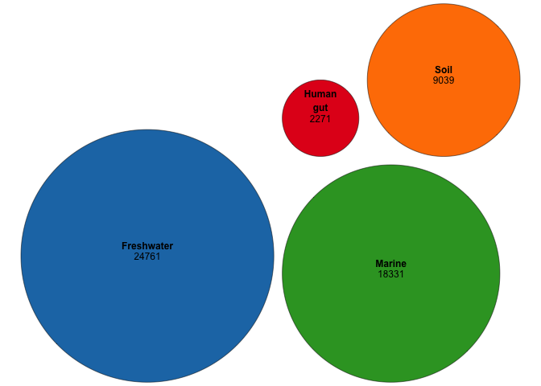
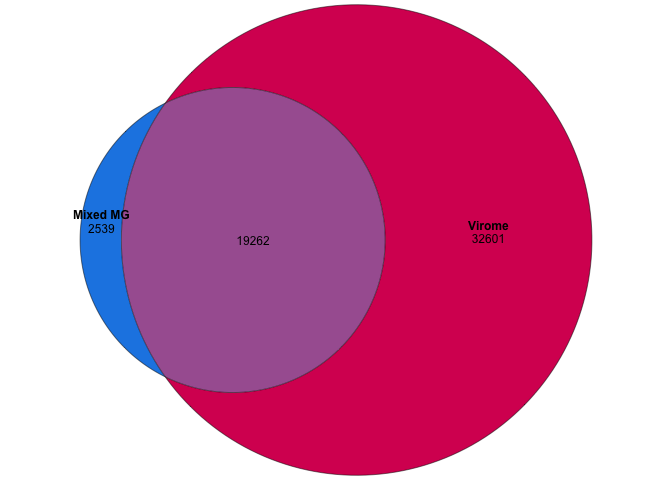
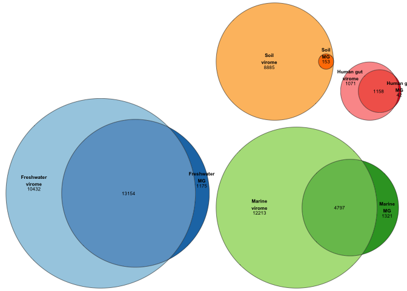
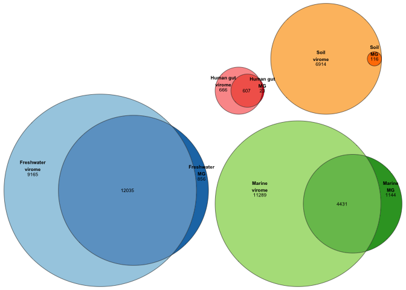
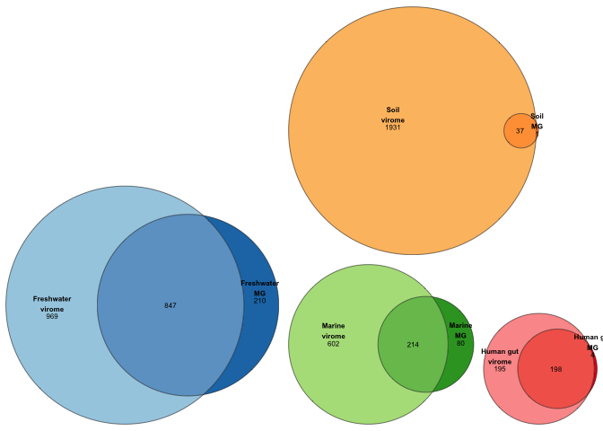
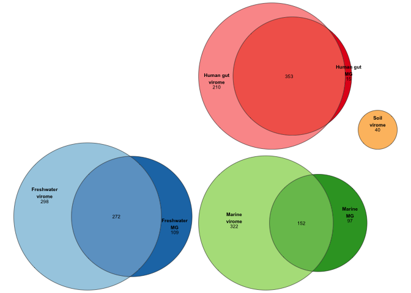
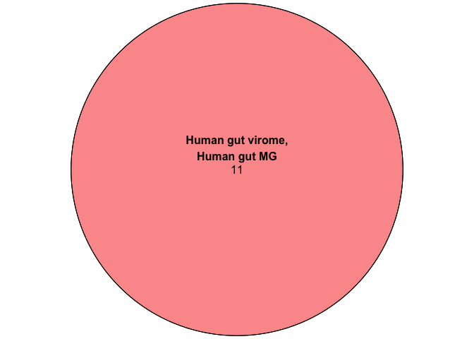
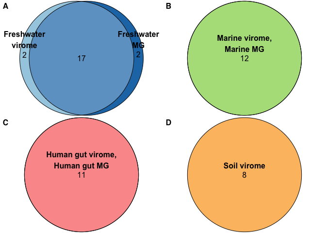

Figure 3, Figure S4, Figure S5
================
James C. Kosmopoulos
2023-12-05

# Load packages

``` r
library(tidyverse); packageVersion("tidyverse")
```

    ## [1] '2.0.0'

``` r
library(eulerr); packageVersion("eulerr")
```

    ## [1] '7.0.0'

``` r
library(cowplot); packageVersion("cowplot")
```

    ## [1] '1.1.1'

``` r
library(vegan); packageVersion("vegan")
```

    ## [1] '2.6.4'

# Load data

``` r
data_reform <- readRDS("../Data/stats_and_metadata.RDS")
vir_info <- readRDS("../Data/virus_summary_info_combined.RDS")
vir_tax <- readRDS("../Data/virus_tax_classification_results_combined.RDS")

present.gut <- readRDS("../Data/present_gut.RDS")
present.gut.vir <- readRDS("../Data/present_gut_vir.RDS")
present.gut.mg <- readRDS("../Data/present_gut_mg.RDS")
present.fw <- readRDS("../Data/present_fw.RDS")
present.fw.vir <- readRDS("../Data/present_fw_vir.RDS")
present.fw.mg <- readRDS("../Data/present_fw_mg.RDS")
present.mar <- readRDS("../Data/present_mar.RDS")
present.mar.vir <- readRDS("../Data/present_mar_vir.RDS")
present.mar.mg <- readRDS("../Data/present_mar_mg.RDS")
present.soil <- readRDS("../Data/present_soil.RDS")
present.soil.vir <- readRDS("../Data/present_soil_vir.RDS")
present.soil.mg <- readRDS("../Data/present_soil_mg.RDS")
present.all <- readRDS("../Data/present_all.RDS")
present.all.vir <- readRDS("../Data/present_all_vir.RDS")
present.all.mg <- readRDS("../Data/present_all_mg.RDS")
```

# Virus presence/absence, Euler diagrams

This code was adapted from R code written by Christian Santos-Medellin
from the github project
[SpatialTemporalViromes](https://github.com/cmsantosm/SpatioTemporalViromes)
from the notebook
[ooc_ab.nb.html](https://github.com/cmsantosm/SpatioTemporalViromes/blob/master/Analysis/Scripts/occ_ab.nb.html).

``` r
pal <- c("Virome" = "#D81B60", "Mixed MG" = "#1E88E5") # Make color palette
pal_fresh <- RColorBrewer::brewer.pal(n=8,"Paired")[1:2]
pal_marine <- RColorBrewer::brewer.pal(n=8,"Paired")[3:4]
pal_gut <- RColorBrewer::brewer.pal(n=8,"Paired")[5:6]
pal_soil <-RColorBrewer::brewer.pal(n=8,"Paired")[7:8]
```

## Figure 3

Note that this figure was later modified manually after saving so that
labels were more clear, and some diagrams were rearranged.

### All environments

``` r
euler.p.allenv <- plot(euler(list("Freshwater" = present.fw,
                                  "Marine" = present.mar,
                                  "Human\ngut" = present.gut,
                                  "Soil" = present.soil)),
                             fills = c(
                              pal_fresh[2],
                              pal_marine[2],
                              pal_gut[2],
                              pal_soil[2]),
                             edges = list(col = c("black", "black"), lex = 0.5),
                             labels = list(fontfamily = "Arial", cex = 0.75),
                             quantities = list(fontfamily = "Arial", cex = 0.75))
euler.p.allenv
```

<!-- -->

### All samples

``` r
euler.p.all <- plot(euler(list("Mixed MG" = present.all.mg, Virome = present.all.vir)),
     fills = pal[c(2,1)],
     edges = list(col = c("black", "black"), lex = 0.5),
     labels = list(fontfamily = "Arial",
                   col = c("black", "black", "black"),
                   cex = 0.75),
     quantities = list(fontfamily = "Arial",
                   col = c("black", "black", "black"),
                   cex = 0.75))
euler.p.all
```

<!-- -->

### Plot all environments, split by method

``` r
euler.p.meth.total <- plot(euler(list("Freshwater\nvirome" = present.fw.vir,
                                     "Freshwater\nMG" = present.fw.mg,
                                     "Marine\nvirome" = present.mar.vir,
                                     "Marine\nMG" =present.mar.mg,
                                     "Soil\nvirome" = present.soil.vir,
                                     "Soil\nMG" = present.soil.mg,
                                     "Human gut \nvirome" = present.gut.vir,
                                     "Human gut\nMG" = present.gut.mg)),
                                     fills = c(
                                       pal_fresh,
                                       pal_marine,
                                       pal_soil,
                                       pal_gut),
                                     edges = list(col = c("black", "black"), lex = 0.5),
                                     labels = list(fontfamily = "Arial", cex = 0.5),
                                     quantities = list(fontfamily = "Arial", cex = 0.5))
euler.p.meth.total
```

<!-- -->

### Lytic, separated by environment

``` r
euler.p.lytic <- plot(euler(list(
  "Freshwater\nvirome" = present.fw.vir[present.fw.vir %in% subset(vir_info, lytic_state == "Lytic")$genome],
  "Freshwater\nMG" = present.fw.mg[present.fw.mg %in% subset(vir_info, lytic_state == "Lytic")$genome],
  "Marine\nvirome" = present.mar.vir[present.mar.vir %in% subset(vir_info, lytic_state == "Lytic")$genome],
  "Marine\nMG" = present.mar.mg[present.mar.mg %in% subset(vir_info, lytic_state == "Lytic")$genome],
  "Human gut\nvirome" = present.gut.vir[present.gut.vir %in% subset(vir_info, lytic_state == "Lytic")$genome],
  "Human gut\nMG" = present.gut.mg[present.gut.mg %in% subset(vir_info, lytic_state == "Lytic")$genome],
  "Soil\nvirome" = present.soil.vir[present.soil.vir %in% subset(vir_info, lytic_state == "Lytic")$genome],
  "Soil\nMG" = present.soil.mg[present.soil.mg %in% subset(vir_info, lytic_state == "Lytic")$genome]
 )),
fills = c(pal_fresh,
          pal_marine,
          pal_gut,
          pal_soil),
edges = list(col = c("black", "black"), lex = 0.5),
labels = list(fontfamily = "Arial", cex = 0.5),
quantities = list(fontfamily = "Arial", cex = 0.5))
euler.p.lytic
```

<!-- -->

### Lysogenic, separated by environment

``` r
euler.p.lyso <- plot(euler(list(
  "Freshwater\nvirome" = present.fw.vir[present.fw.vir %in% subset(vir_info, lytic_state == "Lysogenic")$genome],
  "Freshwater\nMG" = present.fw.mg[present.fw.mg %in% subset(vir_info, lytic_state == "Lysogenic")$genome],
  "Marine\nvirome" = present.mar.vir[present.mar.vir %in% subset(vir_info, lytic_state == "Lysogenic")$genome],
  "Marine\nMG" = present.mar.mg[present.mar.mg %in% subset(vir_info, lytic_state == "Lysogenic")$genome],
  "Human gut\nvirome" = present.gut.vir[present.gut.vir %in% subset(vir_info, lytic_state == "Lysogenic")$genome],
  "Human gut\nMG" = present.gut.mg[present.gut.mg %in% subset(vir_info, lytic_state == "Lysogenic")$genome],
  "Soil\nvirome" = present.soil.vir[present.soil.vir %in% subset(vir_info, lytic_state == "Lysogenic")$genome],
  "Soil\nMG" = present.soil.mg[present.soil.mg %in% subset(vir_info, lytic_state == "Lysogenic")$genome]
 )),
fills = c(pal_fresh,
          pal_marine,
          pal_gut,
          pal_soil),
edges = list(col = c("black", "black"), lex = 0.5),
labels = list(fontfamily = "Arial", cex = 0.5),
quantities = list(fontfamily = "Arial", cex = 0.5))
euler.p.lyso
```

<!-- -->

### Integrated prophage, separated by environment

``` r
euler.p.intpro <- plot(euler(list(
  "Freshwater\nvirome" = present.fw.vir[present.fw.vir %in% subset(vir_info, lytic_state == "Int. prophage")$genome],
  "Freshwater\nMG" = present.fw.mg[present.fw.mg %in% subset(vir_info, lytic_state == "Int. prophage")$genome],
  "Marine\nvirome" = present.mar.vir[present.mar.vir %in% subset(vir_info, lytic_state == "Int. prophage")$genome],
  "Marine\nMG" = present.mar.mg[present.mar.mg %in% subset(vir_info, lytic_state == "Int. prophage")$genome],
  "Human gut\nvirome" = present.gut.vir[present.gut.vir %in% subset(vir_info, lytic_state == "Int. prophage")$genome],
  "Human gut\nMG" = present.gut.mg[present.gut.mg %in% subset(vir_info, lytic_state == "Int. prophage")$genome],
  "Soil\nvirome" = present.soil.vir[present.soil.vir %in% subset(vir_info, lytic_state == "Int. prophage")$genome],
  "Soil\nMG" = present.soil.mg[present.soil.mg %in% subset(vir_info, lytic_state == "Int. prophage")$genome]
 )),
fills = c(pal_fresh,
          pal_marine,
          pal_gut,
          pal_soil),
edges = list(col = c("black", "black"), lex = 0.5),
labels = list(fontfamily = "Arial", cex = 0.5),
quantities = list(fontfamily = "Arial", cex = 0.5))
euler.p.intpro
```

<!-- -->

### Patch them together into “Figure 3”

Note that this figure was modified manually after saving so that labels
were more clear, and some diagrams were rearranged.

``` r
Fig3 <- cowplot::plot_grid(euler.p.allenv, euler.p.all, euler.p.meth.total, euler.p.lytic, euler.p.lyso, euler.p.intpro, ncol = 2, labels = "AUTO", align = "v", axis = "l", label_size = 12, label_fontfamily = "sans")
Fig3
```

<!-- -->

``` r
ggsave("../Plots/Fig3.png", plot=Fig3, device = "png", width = 7.5, height = 6.5, units = "in", dpi = 600, scale = 1)
```

## Figure S4

## Make a modified taxonomy dataframe for plotting

``` r
vir_tax_fam_factored <- vir_tax
colnames(vir_tax_fam_factored) <- c("Sample", "Genome", "Realm", "Kingdom", "Phylum", "Class", "Order", "Family", "Genus", "Species", "source", "sample_source", "Environment", "Method", "env2", "method2")
vir_tax_fam_factored$Method <- vir_tax_fam_factored$method2
vir_tax_fam_factored$Environment <- vir_tax_fam_factored$env2
vir_tax_fam_factored$Family <- factor(vir_tax_fam_factored$Family, levels=c(sort(unique(vir_tax_fam_factored$Family[vir_tax_fam_factored$Family %in% "NA" == FALSE])),"NA"))
```

## Plot

``` r
FigS4 <- ggplot(data=vir_tax_fam_factored) +
  geom_bar(aes(x=Family, fill=Method), stat="count", position=position_dodge()) +
  geom_text(stat='count', position = position_dodge(1), aes(x=Family, fill=Method, color=Method, label=..count..), vjust = -0.5, size = 3) +
  scale_y_log10(limits = c(1,100000)) +
  facet_wrap(~Environment, ncol=1) +
  theme_linedraw() +
  theme(legend.position = "right", axis.text.x = element_text(angle = 45, hjust=1)) +
  ylab("Count") +
  xlab("Family") +
  scale_color_manual(name= "Method", values = c("Virome" = "#D81B60", "Mixed MG" = "#1E88E5")) +
  scale_fill_manual(name= "Method", values = c("Virome" = "#D81B60", "Mixed MG" = "#1E88E5"))
FigS4
```

<!-- -->

``` r
ggsave("../Plots/FigS4.png", plot=FigS4, device = "png", width = 9, height = 6.5, units = "in", dpi = 600, scale = 1.5)
```

## Figure S5

### Families: Freshwater

``` r
euler.p.fam.fresh <- plot(euler(list(
  "Freshwater\nvirome" = unique(subset(vir_tax, genome %in% present.fw.vir & family != "NA")$family),
  "Freshwater\nMG" = unique(subset(vir_tax, genome %in% present.fw.mg & family != "NA")$family)
  )),
 fills = c(pal_fresh),
 edges = list(col = c("black", "black"), lex = 1),
 labels = list(fontfamily = "Arial", cex = 1),
 quantities = list(fontfamily = "Arial", cex = 1))
euler.p.fam.fresh
```

<!-- -->

### Families: marine

``` r
euler.p.fam.marine <- plot(euler(list(
  "Marine virome" = unique(subset(vir_tax, genome %in% present.mar.vir & family != "NA")$family),
  "\nMarine MG" = unique(subset(vir_tax, genome %in% present.mar.vir & family != "NA")$family)
  )),
 fills = c(pal_marine),
 edges = list(col = c("black", "black"), lex = 1),
 labels = list(fontfamily = "Arial", cex = 1),
 quantities = list(fontfamily = "Arial", cex = 1))
euler.p.fam.marine
```

<!-- -->

### Families: human gut

``` r
euler.p.fam.gut <- plot(euler(list(
  "Human gut virome" = unique(subset(vir_tax, genome %in% present.gut.vir & family != "NA")$family),
  "\nHuman gut MG" = unique(subset(vir_tax, genome %in% present.gut.mg & family != "NA")$family)
  )),
 fills = c(pal_gut),
 edges = list(col = c("black", "black"), lex = 1),
 labels = list(fontfamily = "Arial", cex = 1),
 quantities = list(fontfamily = "Arial", cex = 1))
euler.p.fam.gut
```

<!-- -->

### Families: soil

``` r
euler.p.fam.soil <- plot(euler(list(
  "Soil virome" = unique(subset(vir_tax, genome %in% present.soil.vir & family != "NA")$family),
  "Soil MG" = unique(subset(vir_tax, genome %in% present.soil.mg & family != "NA")$family)
  )),
 fills = c(pal_soil),
 edges = list(col = c("black", "black"), lex = 1),
 labels = list(fontfamily = "Arial", cex = 1),
 quantities = list(fontfamily = "Arial", cex = 1))
euler.p.fam.soil
```

<!-- -->

### Patch them together into Figure S5

``` r
FigS5 <- cowplot::plot_grid(euler.p.fam.fresh,
                           euler.p.fam.marine,
                           euler.p.fam.gut,
                           euler.p.fam.soil,
                           ncol = 2,
                           align = "v", axis = "l",
                           labels = "AUTO", label_size = 12, label_fontfamily = "sans")
FigS5
```

<!-- -->

``` r
ggsave("../Plots/FigS5.png", plot=FigS5, device = "png", width = 6.5, height = 4, units = "in", dpi = 600, scale = 1)
```
