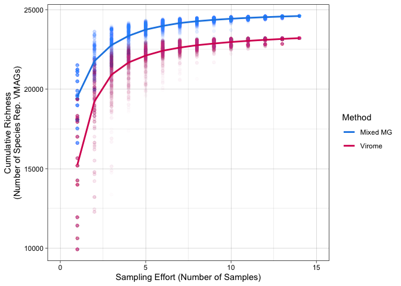
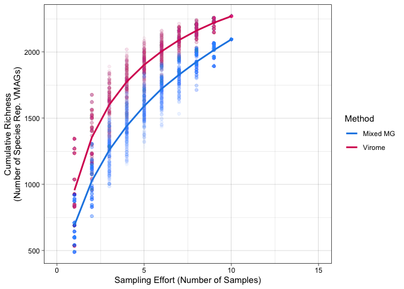

Figure S6
================
James C. Kosmopoulos
2023-12-05

# Load packages

``` r
library(tidyverse); packageVersion("tidyverse")
```

    ## [1] '2.0.0'

``` r
library(vegan); packageVersion("vegan")
```

    ## [1] '2.6.4'

# Figure S6

## Load and subset coverM trimmed-means coverage data

``` r
data_reform <- readRDS("../Data/stats_and_metadata.RDS")

tmeans.gut.vir <- readRDS("../Data/tmeans_gut_vir.RDS")
tmeans.gut.mg <- readRDS("../Data/tmeans_gut_mg.RDS")
tmeans.fw.vir <- readRDS("../Data/tmeans_fw_vir.RDS")
tmeans.fw.mg <- readRDS("../Data/tmeans_fw_mg.RDS")
tmeans.mar.vir <- readRDS("../Data/tmeans_mar_vir.RDS")
tmeans.mar.mg <- readRDS("../Data/tmeans_mar_mg.RDS")
tmeans.soil.vir <- readRDS("../Data/tmeans_soil_vir.RDS")
tmeans.soil.mg <- readRDS("../Data/tmeans_soil_mg.RDS")
```

The following code was adapted from R code written by Christian
Santos-Medellin from the github project
[SpatialTemporalViromes](https://github.com/cmsantosm/SpatioTemporalViromes)
from the notebook
[ooc_ab.nb.html](https://github.com/cmsantosm/SpatioTemporalViromes/blob/master/Analysis/Scripts/occ_ab.nb.html).

## Make permutations and combine results for each environment, and plot

### Freshwater

``` r
vmag.sp.fresh.vi <- specaccum(t(tmeans.fw.vir), method = "random", permutations = 1000)
vmag.perm.fresh.vi <- vmag.sp.fresh.vi$perm
vmag.perm.fresh.vi.tidy <- as.tibble(vmag.perm.fresh.vi) %>% 
  mutate(Sites = 1:nrow(.)) %>% 
  gather(key = "Permutation", value = "Species", -Sites) 
vmag.sp.fresh.mg <- specaccum(t(tmeans.fw.mg), method = "random", permutations = 1000)
vmag.perm.fresh.mg <- vmag.sp.fresh.mg$perm
vmag.perm.fresh.mg.tidy <- as.tibble(vmag.perm.fresh.mg) %>% 
  mutate(Sites = 1:nrow(.)) %>% 
  gather(key = "Permutation", value = "Species", -Sites)
vmag.perm.fresh.tidy <- rbind(mutate(vmag.perm.fresh.vi.tidy, Method = "Mixed MG"), mutate(vmag.perm.fresh.mg.tidy, Method = "Virome"))
fresh.vi.richness <- data.frame(Sites = vmag.sp.fresh.vi$sites, Species = vmag.sp.fresh.vi$richness)
fresh.mg.richness <- data.frame(Sites = vmag.sp.fresh.mg$sites, Species = vmag.sp.fresh.mg$richness)
fresh.richness <- rbind(mutate(fresh.mg.richness, Method = "Virome"), mutate(fresh.vi.richness, Method = "Mixed MG"))

acc.plot.fresh <- ggplot(vmag.perm.fresh.tidy, aes(Sites, Species, color = Method)) +
  geom_point(alpha = 0.01)+
  geom_line(data = fresh.richness, size = 1, shape = 16) +
  #facet_zoom(y = Method == "Mixed MG", zoom.size = 1, show.area = T) +
  scale_color_manual(name= "Method", values = c("Virome" = "#D81B60", "Mixed MG" = "#1E88E5")) +
  xlim(0,15) +
  ylab("Cumulative Richness\n(Number of Species Rep. VMAGs)") +
  xlab("Sampling Effort (Number of Samples)") +
  theme_linedraw()
acc.plot.fresh
```

<!-- -->

### Human gut

``` r
vmag.sp.gut.vi <- specaccum(t(tmeans.gut.vir), method = "random", permutations = 1000)
vmag.perm.gut.vi <- vmag.sp.gut.vi$perm
vmag.perm.gut.vi.tidy <- as.tibble(vmag.perm.gut.vi) %>% 
  mutate(Sites = 1:nrow(.)) %>% 
  gather(key = "Permutation", value = "Species", -Sites) 
vmag.sp.gut.mg <- specaccum(t(tmeans.gut.mg), method = "random", permutations = 1000)
vmag.perm.gut.mg <- vmag.sp.gut.mg$perm
vmag.perm.gut.mg.tidy <- as.tibble(vmag.perm.gut.mg) %>% 
  mutate(Sites = 1:nrow(.)) %>% 
  gather(key = "Permutation", value = "Species", -Sites)
vmag.perm.gut.tidy <- rbind(mutate(vmag.perm.gut.vi.tidy, Method = "Virome"), mutate(vmag.perm.gut.mg.tidy, Method = "Mixed MG"))
gut.vi.richness <- data.frame(Sites = vmag.sp.gut.vi$sites, Species = vmag.sp.gut.vi$richness)
gut.mg.richness <- data.frame(Sites = vmag.sp.gut.mg$sites, Species = vmag.sp.gut.mg$richness)
gut.richness <- rbind(mutate(gut.mg.richness, Method = "Mixed MG"), mutate(gut.vi.richness, Method = "Virome"))

acc.plot.gut <- ggplot(vmag.perm.gut.tidy, aes(Sites, Species, color = Method)) +
  geom_point(alpha = 0.01)+
  geom_line(data = gut.richness, size = 1, shape = 16) +
  #facet_zoom(y = Method == "Mixed MG", zoom.size = 1, show.area = T) +
  scale_color_manual(name= "Method", values = c("Virome" = "#D81B60", "Mixed MG" = "#1E88E5")) +
  xlim(0,15) +
  ylab("Cumulative Richness\n(Number of Species Rep. VMAGs)") +
  xlab("Sampling Effort (Number of Samples)") +
  theme_linedraw()
acc.plot.gut
```

<!-- -->

### Marine

``` r
vmag.sp.marine.vi <- specaccum(t(tmeans.mar.vir), method = "random", permutations = 1000)
vmag.perm.marine.vi <- vmag.sp.marine.vi$perm
vmag.perm.marine.vi.tidy <- as.tibble(vmag.perm.marine.vi) %>% 
  mutate(Sites = 1:nrow(.)) %>% 
  gather(key = "Permutation", value = "Species", -Sites) 
vmag.sp.marine.mg <- specaccum(t(tmeans.mar.mg), method = "random", permutations = 1000)
vmag.perm.marine.mg <- vmag.sp.marine.mg$perm
vmag.perm.marine.mg.tidy <- as.tibble(vmag.perm.marine.mg) %>% 
  mutate(Sites = 1:nrow(.)) %>% 
  gather(key = "Permutation", value = "Species", -Sites)
vmag.perm.marine.tidy <- rbind(mutate(vmag.perm.marine.vi.tidy, Method = "Virome"), mutate(vmag.perm.marine.mg.tidy, Method = "Mixed MG"))
marine.vi.richness <- data.frame(Sites = vmag.sp.marine.vi$sites, Species = vmag.sp.marine.vi$richness)
marine.mg.richness <- data.frame(Sites = vmag.sp.marine.mg$sites, Species = vmag.sp.marine.mg$richness)
marine.richness <- rbind(mutate(marine.mg.richness, Method = "Mixed MG"), mutate(marine.vi.richness, Method = "Virome"))

acc.plot.marine <- ggplot(vmag.perm.marine.tidy, aes(Sites, Species, color = Method)) +
  geom_point(alpha = 0.01)+
  geom_line(data = marine.richness, size = 1, shape = 16) +
  #facet_zoom(y = Method == "Mixed MG", zoom.size = 1, show.area = T) +
  scale_color_manual(name= "Method", values = c("Virome" = "#D81B60", "Mixed MG" = "#1E88E5")) +
  xlim(0,22) +
  ylab("Cumulative Richness\n(Number of Species Rep. VMAGs)") +
  xlab("Sampling Effort (Number of Samples)") +
  theme_linedraw()
acc.plot.marine
```

<!-- -->

### Soil

``` r
vmag.sp.soil.vi <- specaccum(t(tmeans.soil.vir), method = "random", permutations = 1000)
vmag.perm.soil.vi <- vmag.sp.soil.vi$perm
vmag.perm.soil.vi.tidy <- as.tibble(vmag.perm.soil.vi) %>% 
  mutate(Sites = 1:nrow(.)) %>% 
  gather(key = "Permutation", value = "Species", -Sites) 
vmag.sp.soil.mg <- specaccum(t(tmeans.soil.mg), method = "random", permutations = 1000)
vmag.perm.soil.mg <- vmag.sp.soil.mg$perm
vmag.perm.soil.mg.tidy <- as.tibble(vmag.perm.soil.mg) %>% 
  mutate(Sites = 1:nrow(.)) %>% 
  gather(key = "Permutation", value = "Species", -Sites)
vmag.perm.soil.tidy <- rbind(mutate(vmag.perm.soil.vi.tidy, Method = "Virome"), mutate(vmag.perm.soil.mg.tidy, Method = "Mixed MG"))
soil.vi.richness <- data.frame(Sites = vmag.sp.soil.vi$sites, Species = vmag.sp.soil.vi$richness)
soil.mg.richness <- data.frame(Sites = vmag.sp.soil.mg$sites, Species = vmag.sp.soil.mg$richness)
soil.richness <- rbind(mutate(soil.mg.richness, Method = "Mixed MG"), mutate(soil.vi.richness, Method = "Virome"))

acc.plot.soil <- ggplot(vmag.perm.soil.tidy, aes(Sites, Species, color = Method)) +
  geom_point(alpha = 0.01)+
  geom_line(data = soil.richness, size = 1, shape = 16) +
  #facet_zoom(y = Method == "Mixed MG", zoom.size = 1, show.area = T) +
  scale_color_manual(name= "Method", values = c("Virome" = "#D81B60", "Mixed MG" = "#1E88E5")) +
  xlim(0,15) +
  ylab("Cumulative Richness\n(Number of Species Rep. VMAGs)") +
  xlab("Sampling Effort (Number of Samples)") +
  theme_linedraw()
acc.plot.soil
```

<!-- -->

## Combine species accumulation tables to make a faceted plot

``` r
# Curves
vmag.perm.fresh.tidy$Environment <- "Freshwater"
vmag.perm.gut.tidy$Environment <- "Human gut"
vmag.perm.marine.tidy$Environment <- "Marine"
vmag.perm.soil.tidy$Environment <- "Soil"
vmag.perm.all.tidy <- rbind(
vmag.perm.fresh.tidy,
  vmag.perm.gut.tidy,
  vmag.perm.marine.tidy,
  vmag.perm.soil.tidy
  )
# Dots
fresh.richness$Environment <- "Freshwater"
gut.richness$Environment <- "Human gut"
marine.richness$Environment <- "Marine"
soil.richness$Environment <- "Soil"
all.richness <- rbind(
  fresh.richness,
  gut.richness,
  marine.richness,
  soil.richness
)
```

## Plot the faceted curves to make Figure S6

``` r
FigS6 <- ggplot(vmag.perm.all.tidy, aes(Sites, Species, color = Method)) +
  geom_point(alpha = 0.01)+
  geom_line(data = all.richness, size = 1, shape = 16) +
  facet_wrap(. ~ Environment, ncol = 4, scales="free_y") +
  scale_color_manual(name= "Method", values = c("Virome" = "#D81B60", "Mixed MG" = "#1E88E5")) +
  xlim(0,21) +
  ylab("Cumulative Richness\n(Number of Species Rep. VMAGs)") +
  xlab("Sampling Effort (Number of Samples)") +
  theme_linedraw() +
  theme(legend.position = "bottom")
FigS6
```

<!-- -->

``` r
ggsave("../Plots/FigS6.png", plot=FigS6, device = "png", width = 6.5, height = 4, units = "in", dpi = 600)
```
