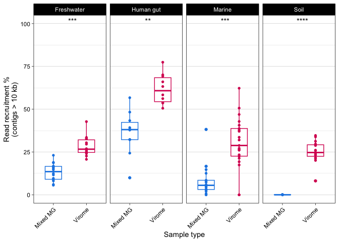
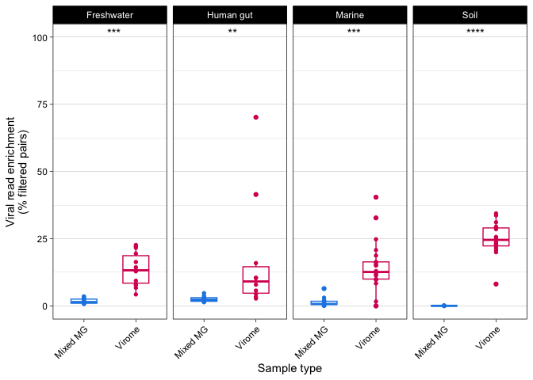
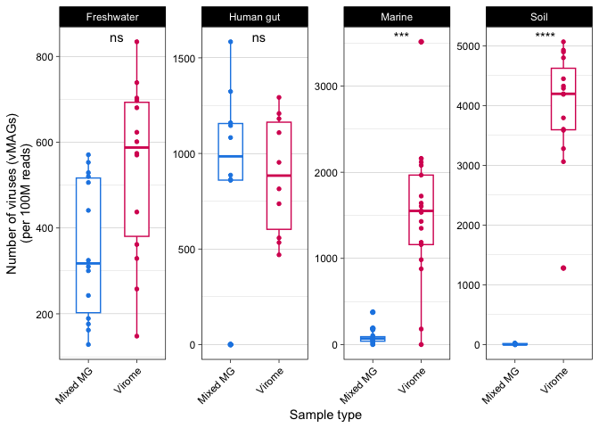
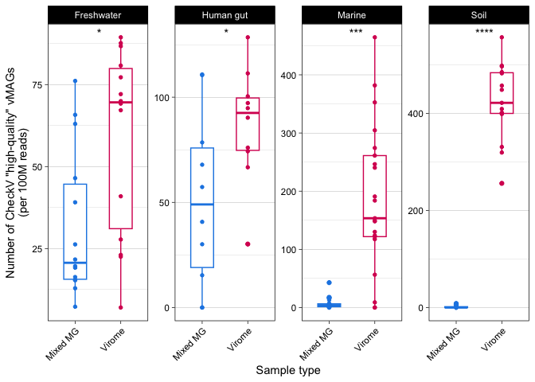
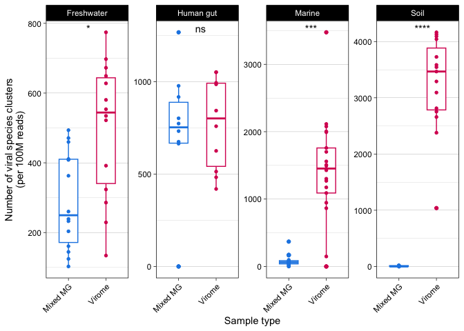
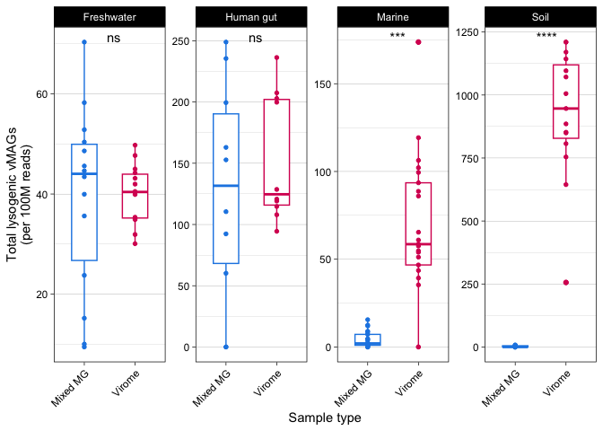
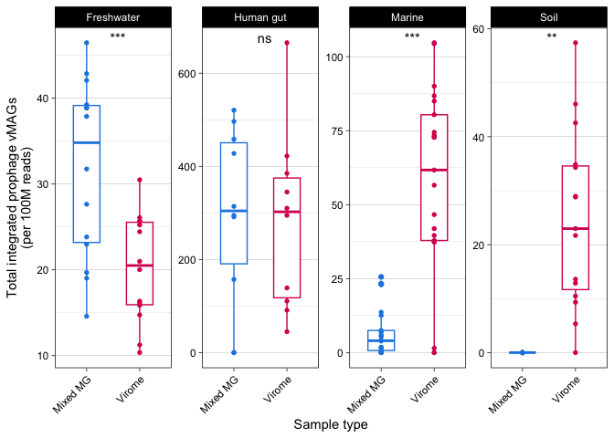
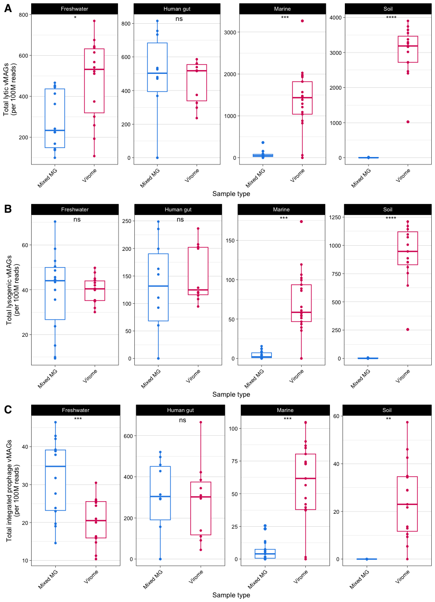

Figure 2, Figure S1, Figure S2, Figure S3
================
James C. Kosmopoulos
2023-12-05

# Load packages

``` r
library(ggpubr); packageVersion("ggpubr")
```

    ## [1] '0.6.0'

``` r
library(tidyverse); packageVersion("tidyverse")
```

    ## [1] '2.0.0'

``` r
library(cowplot); packageVersion("cowplot")
```

    ## [1] '1.1.1'

# Load data

``` r
data_reform <- readRDS("../Data/stats_and_metadata.RDS")
contig_stats_melt <-  readRDS("../Data/contig_stats_melt.RDS")
```

# Figure 2

## Sequencing depth

``` r
plot.seq.depth.paired <- ggpaired(data_reform,
                                  id = "sample_source",
                                  x = "method2",
                                  y = "Reads_paired_reads_million",
                                  add = "jitter",
                                  facet.by ="env2",
                                  color = "method2", line.color = "gray", line.size = 0) +
                        scale_color_manual(name= "Method", values = c("Virome" = "#D81B60", "Mixed MG" = "#1E88E5")) +
                            facet_wrap(. ~ env2, ncol = 4, scales="free_y") +
                            theme_linedraw() +
                            theme(legend.position = "none", panel.grid.major.x = element_blank(), axis.text.x = element_text(angle = 45,  hjust=1)) +
                            ylab("Sequencing depth\n(millions of filtered read pairs)") +
                            xlab("Method") +
                            stat_compare_means(aes(x = method2, label = ..p.signif..),label.x = 1.5, paired = T)
plot.seq.depth.paired
```

<!-- -->

## Read recruitment

``` r
plot.recruit.paired <- ggpaired(data_reform,
                                  id = "sample_source",
                                  x = "method2",
                                  y = "contig_10000_reads_percent",
                                  add = "jitter",
                                  facet.by ="env2",
                                  color = "method2", line.color = "gray", line.size = 0) +
                            scale_color_manual(name= "Method", values = c("Virome" = "#D81B60", "Mixed MG" = "#1E88E5")) +
                            facet_wrap(. ~ env2, ncol = 4) +
                            ylim(0,100) + 
                            theme_linedraw() +
                            theme(legend.position = "none", panel.grid.major.x = element_blank(), axis.text.x = element_text(angle = 45,  hjust=1)) +
                            ylab("Read recruitment %\n(contigs > 10 kb)") +
                            xlab("Method") +
                            stat_compare_means(aes(x = method2, label = ..p.signif..),label.x = 1.5, paired = T)
plot.recruit.paired
```

<!-- -->

## Viral enrichment (reads)

``` r
plot.viral.reads.enrich.paired <- ggpaired(data_reform,
                                  id = "sample_source",
                                  x = "method2",
                                  y = "viral_reads_percent",
                                  add = "jitter",
                                  facet.by ="env2",
                                  color = "method2", line.color = "gray", line.size = 0) +
                            scale_color_manual(name= "Method", values = c("Virome" = "#D81B60", "Mixed MG" = "#1E88E5")) +
                            facet_wrap(. ~ env2, ncol = 4) +
                            ylim(0,100) +
                            theme_linedraw() +
                            theme(legend.position = "none", panel.grid.major.x = element_blank(), axis.text.x = element_text(angle = 45, hjust=1)) +
                            ylab("Viral read enrichment\n(% filtered pairs)") +
                            xlab("Method") +
                            stat_compare_means(aes(x = method2, label = ..p.signif..),label.x = 1.5, paired = T)
plot.viral.reads.enrich.paired
```

<!-- -->

## Viral enrichment (contigs)

``` r
plot.viral.contigs.enrich.paired <- ggpaired(data_reform,
                                  id = "sample_source",
                                  x = "method2",
                                  y = "viral_contig_percent_10000",
                                  add = "jitter",
                                  facet.by ="env2",
                                  color = "method2", line.color = "gray", line.size = 0) +
                            scale_color_manual(name= "Method", values = c("Virome" = "#D81B60", "Mixed MG" = "#1E88E5")) +
                            facet_wrap(. ~ env2, ncol = 4) +
                            ylim(0,100) +
                            theme_linedraw() +
                            theme(legend.position = "none", panel.grid.major.x = element_blank(), axis.text.x = element_text(angle = 45,  hjust=1)) +
                            ylab("Viral contig enrichment\n(% contigs > 10 kb)") +
                            xlab("Method") +
                            stat_compare_means(aes(x = method2, label = ..p.signif..),label.x = 1.5, paired = T)
plot.viral.contigs.enrich.paired
```

<!-- -->

## Patch together into Figure 2

``` r
Fig2 <- cowplot::plot_grid(plot.seq.depth.paired, plot.recruit.paired, plot.viral.reads.enrich.paired, plot.viral.contigs.enrich.paired, ncol = 2, labels = "AUTO", align = "v", axis = "l", label_size = 18, label_fontfamily = "sans")
Fig2
```

<!-- -->

``` r
ggsave("../Plots/Fig2.png", plot=Fig2, device = "png", width = 6.5, height = 6.5, units = "in", dpi = 600, scale = 1.5)
```

# Figure S1

``` r
FigS1 <- ggpaired(contig_stats_melt,
                                  id = "sample_source",
                                  x = "method2",
                                  y = "value",
                                  add = "jitter",
                                  facet.by = c("env2", "variable"),
                                  color = "method2", line.color = "gray", line.size = 0) +
                            scale_color_manual(name= "Method", values = c("Mixed MG" = "#1E88E5", "Virome" = "#D81B60")) +
                            facet_wrap(env2 ~ variable, ncol = 4, scales="free_y") +
                            theme_linedraw() +
                            theme(legend.position = "none", panel.grid.major.x = element_blank()) +
                            ylab("Value") +
                            xlab("Method") +
                            stat_compare_means(aes(x = method2, label = ..p.signif..),label.x = 1.5, paired = T)
FigS1
```

<!-- -->

``` r
ggsave("../Plots/FigS1.png", plot=FigS1, device = "png", width = 6.5, height = 9, units = "in", dpi = 600, scale = 1.5)
```

# Figure S2

## Number of viral contigs (normalized)

``` r
plot.viral_contigs.paired <- ggpaired(data_reform,
                                   id = "sample_source",
                                   x = "method2",
                                   y = "viral.scaffold.no_norm",
                                   add = "jitter",
                                   facet.by = "env2",
                                   color = "method2", line.color = "gray", line.size = 0) +
                            scale_color_manual(name= "Method", values = c("Mixed MG" = "#1E88E5", "Virome" = "#D81B60")) +
                            facet_wrap(. ~ env2, ncol = 4, scales="free_y") +
                            theme_linedraw() +
                            theme(legend.position = "none", panel.grid.major.x = element_blank(), axis.text.x = element_text(angle = 45,  hjust=1)) +
                            ylab("Number of viral contigs\n(per 100M reads)") +
                            xlab("Method") +
                            stat_compare_means(aes(x = method2, label = ..p.signif..),label.x = 1.5, paired = T)
plot.viral_contigs.paired
```

<!-- -->

## Number of VMAGs (normalized)

``` r
plot.VMAGs.paired <- ggpaired(data_reform,
                                   id = "sample_source",
                                   x = "method2",
                                   y = "virus.no_norm",
                                   add = "jitter",
                                   facet.by = "env2",
                                   color = "method2", line.color = "gray", line.size = 0) +
                            scale_color_manual(name= "Method", values = c("Mixed MG" = "#1E88E5", "Virome" = "#D81B60")) +
                            facet_wrap(. ~ env2, ncol = 4, scales="free_y") +
                            theme_linedraw() +
                            theme(legend.position = "none", panel.grid.major.x = element_blank(), axis.text.x = element_text(angle = 45,  hjust=1)) +
                            ylab("Number of viruses (vMAGs)\n(per 100M reads)") +
                            xlab("Method") +
                            stat_compare_means(aes(x = method2, label = ..p.signif..),label.x = 1.5, paired = T)
plot.VMAGs.paired
```

<!-- -->

## Plot the number of “high-quality” VMAGs as determined by CheckV

``` r
plot.checkv.just_high.paired <- ggpaired(data_reform,
                        id = "sample_source",
                        x = "method2",
                        y = "checkv_high_norm",
                        add = "jitter",
                        facet.by = "env2",
                        color = "method2", line.color = "gray", line.size = 0) +
                        theme_linedraw() +
                            theme(legend.position = "none", panel.grid.major.x = element_blank(), axis.text.x = element_text(angle = 45,  hjust=1)) +
                        ylab('Number of CheckV "high-quality" vMAGs\n(per 100M reads)') +
                        xlab("Method") +
                        scale_color_manual(name= "Method", values = c("Mixed MG" = "#1E88E5", "Virome" = "#D81B60")) +
                        facet_wrap(~env2, ncol=4, scales="free_y") +
                        stat_compare_means(aes(x = method2, label = ..p.signif..), label.x = 1.5, paired = T)
plot.checkv.just_high.paired
```

<!-- -->

## Number of viral species clusters (normalized)

``` r
plot.species.paired <- ggpaired(data_reform,
                                   id = "sample_source",
                                   x = "method2",
                                   y = "species.cluster.no_norm",
                                   add = "jitter",
                                   facet.by = "env2",
                                   color = "method2", line.color = "gray", line.size = 0) +
                            scale_color_manual(name= "Method", values = c("Mixed MG" = "#1E88E5", "Virome" = "#D81B60")) +
                            facet_wrap(. ~ env2, ncol = 4, scales="free_y") +
                            theme_linedraw() +
                            theme(legend.position = "none", panel.grid.major.x = element_blank(), axis.text.x = element_text(angle = 45,  hjust=1)) +
                            ylab("Number of viral species clusters\n(per 100M reads)") +
                            xlab("Method") +
                            stat_compare_means(aes(x = method2, label = ..p.signif..), label.x = 1.5, paired = T)
plot.species.paired
```

<!-- -->

### Patch them together into Figure S2

``` r
FigS2 <- cowplot::plot_grid(plot.viral_contigs.paired, plot.VMAGs.paired, plot.checkv.just_high.paired, plot.species.paired, ncol = 2, labels = "AUTO", align = "v", axis = "l", label_size = 18, label_fontfamily = "sans")
FigS2
```

<!-- -->

``` r
ggsave("../Plots/FigS2.png", plot=FigS2, device = "png", width = 6.5, height = 6.5, units = "in", dpi = 600, scale = 1.5)
```

# Figure S3

## Number of lytic viruses (normalized)

``` r
plot.lytic.paired <- ggpaired(data_reform,
                        id = "sample_source",
                        x = "method2",
                        y = "lytic_no_norm_reads",
                        add = "jitter",
                        facet.by = "env2",
                        color = "method2", line.color = "gray", line.size = 0) +
                        theme_linedraw() +
                            theme(legend.position = "none", panel.grid.major.x = element_blank(), axis.text.x = element_text(angle = 45,  hjust=1)) +
                        ylab("Total lytic vMAGs\n(per 100M reads)") +
                        xlab("Method") +
                        scale_color_manual(name= "Method", values = c("Virome" = "#D81B60", "Mixed MG" = "#1E88E5")) +
                        facet_wrap(~env2, ncol=4, scales="free_y") +
                        stat_compare_means(aes(x = method2, label = ..p.signif..), label.x = 1.5, paired = T)
plot.lytic.paired
```

<!-- -->

## Number of lysogenic viruses (normalized)

``` r
plot.lysogen.paired <- ggpaired(data_reform,
                        id = "sample_source",
                        x = "method2",
                        y = "lysogen_no_norm_reads",
                        add = "jitter",
                        facet.by = "env2",
                        color = "method2", line.color = "gray", line.size = 0) +
                        theme_linedraw() +
                            theme(legend.position = "none", panel.grid.major.x = element_blank(), axis.text.x = element_text(angle = 45,  hjust=1)) +
                        ylab("Total lysogenic vMAGs\n(per 100M reads)") +
                        xlab("Method") +
                        scale_color_manual(name= "Method", values = c("Virome" = "#D81B60", "Mixed MG" = "#1E88E5")) +
                        facet_wrap(~env2, ncol=4, scales="free_y") +
                        stat_compare_means(aes(x = method2, label = ..p.signif..), label.x = 1.5, paired = T)
plot.lysogen.paired
```

<!-- -->

## Number of integrated prophage (normalized)

``` r
plot.prophage.paired <- ggpaired(data_reform,
                        id = "sample_source",
                        x = "method2",
                        y = "int_prophage_no_norm_reads",
                        add = "jitter",
                        facet.by = "env2",
                        color = "method2", line.color = "gray", line.size = 0) +
                        theme_linedraw() +
                            theme(legend.position = "none", panel.grid.major.x = element_blank(), axis.text.x = element_text(angle = 45,  hjust=1)) +
                        ylab("Total integrated prophage vMAGs\n(per 100M reads)") +
                        xlab("Method") +
                        scale_color_manual(name= "Method", values = c("Virome" = "#D81B60", "Mixed MG" = "#1E88E5")) +
                        facet_wrap(~env2, ncol=4, scales="free_y") +
                        stat_compare_means(aes(x = method2, label = ..p.signif..), label.x = 1.5, paired = T)
plot.prophage.paired
```

<!-- -->

### Patch them together into Figure S3

``` r
FigS3 <- cowplot::plot_grid(plot.lytic.paired, plot.lysogen.paired, plot.prophage.paired, nrow = 3, labels = "AUTO", align = "v", axis = "l", label_size = 18, label_fontfamily = "sans")
FigS3
```

<!-- -->

``` r
ggsave("../Plots/FigS3.png", plot=FigS3, device = "png", width = 6.5, height = 9, units = "in", dpi = 600, scale = 1.5)
```
